[TOC]


## 程序运行的基本过程

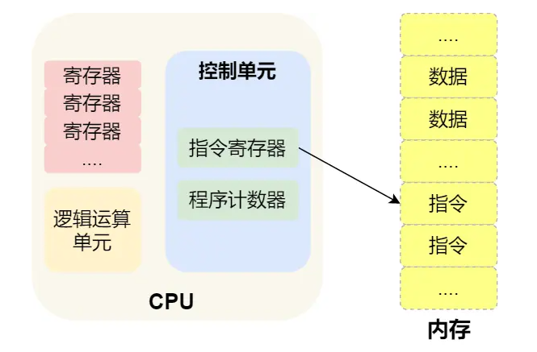

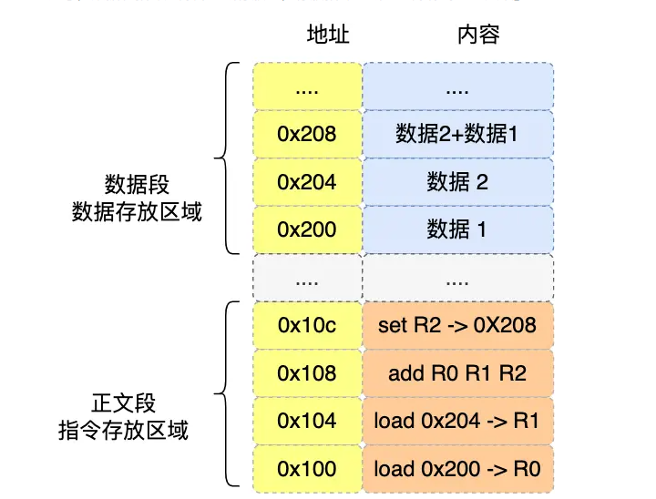

虚拟内存分为数据段和代码段 代码段是编译好的汇编指令

处理一条指令包含六个阶段：取指-译码-执行-访存-写回-更新PC

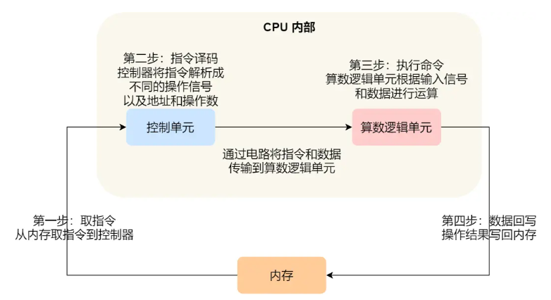

## 存储器层次结构和局部性

#### 局部性

时间局部性：被引用的内存位置在不远的将来可能会被多次引用

空间局部性：一个内存位置被引用了一次，那么程序很可能在将来引用其附近的内存位置

优点：程序运行更快 cache的miss次数少

#### 存储结构

Cache一般是SRAM，访问快但是空间小

内存一般是DRAM。

每个CPU都有自己的Cache

现代内存中，保存的是页和页表，页大小为4kb页，Cache是为了加速内存的访问。

访问内存前，由地址翻译单元MMU通过查快表和页表获取物理地址，然后根据物理地址访问内存中具体的页。

先从L1访问，miss之后再向下继续访问。

Cache的结构分为直接相联，组相联和全相联映射，按照一定的映射方法将不同的物理地址映射到不同的缓存块，通过检查标记位和有效位确实是否hit，L1到L3缓存总空间变大但是访问周期变长。

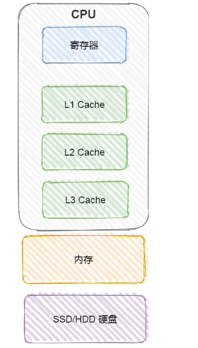

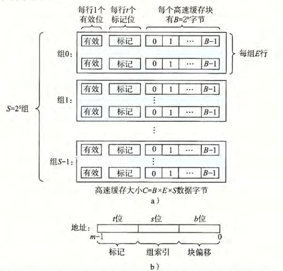

#### 数据写回

###### 写直达

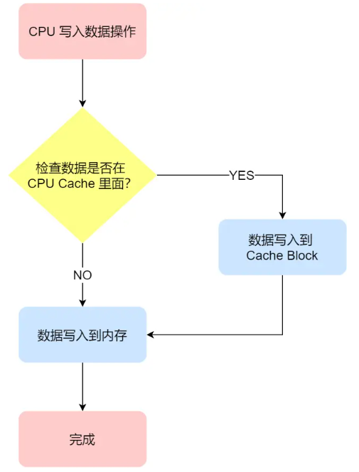

###### 写回

当发生写操作时，新的数据仅仅被写入 Cache Block 里, 只有当修改过的 Cache Block「被替换」时才需要写到内存中，减少写回内存的频率，提高系统性能。

定位数据所在的CacheBlock，miss则标识不在，要替换这个Block，若为脏则写回内存。

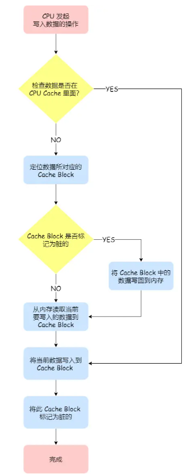

#### 缓存一致性

CPU 都是多核的，由于 L1/L2 Cache 是多个核心各自独有的，那么会带来多核心的**缓存一致性（\*Cache Coherence\*）** 的问题。

#### 解决方法

1. 写传播，某个 CPU 核心里的 Cache 数据更新时，必须要传播到其他核心的 Cache
2. 事务的串行化，某个 CPU 核心里对数据的操作顺序，必须在其他核心看起来顺序是一样的，

## 虚拟

cpu虚拟化： 时分共享

内存虚拟化：虚拟内存，内核引入了虚拟内存地址，为每个进程提供了一个独立的虚拟内存空间，使得进程以为自己独占全部内存资源，再通过内存映射，将虚拟内存地址映射到物理内存地址，使得进程之间互不影响。

* 内核是常驻在物理内存的

## 虚拟地址到物理地址

虚拟地址划分为多个页表索引加偏移量

页表基址寄存器保存一级页表的地址，利用虚拟地址的多个索引结合多级多级页表，获取物理页索引      物理页索引+偏移即实际物理地址

为了加速地址转换:

1. TLB缓存最近的虚拟地址到物理地址的映射
2. 访问内存时，MMU首先检查TLB

## 为什么要有虚拟内存

为每个进程提供独立的虚拟内存空间

#### 作为内存管理的工具

* 简化链接，独立的地址空间允许每个进程的**虚拟内存空间分布使用相同的格式**，忽略实际的代码和数据放在物理内存的何处。

  例如，对于一个可执行文件，在64位下，其虚拟空间中，代码段总是以0x400000开始，数据段跟在后面，栈空间在用户地址空间的最上面，这样简化了链接器的设计和实现。

* 简化加载，通过elf格式的可执行文件，建立虚拟内存和文件的映射，便于加载文件到内存，并执行文件。

  如果有一个a.out文件，在一个程序中通过`execve("a.out",NULL,NULL)` 可以执行这个程序，其**加载并执行的过程**是：

  * 删除原有进程的区域结构(**vm_area_strcut**，记录了虚拟地址空间中代码段数据段各个区域的信息，起始的虚拟地址，映射的文件名，偏移量等等)
  * **映射私有区域**，为新程序的代码、数据、bss、栈区域创建vm_area_strcut链表
  * **映射共享区域**，如链接的动态库
  * 设置pc寄存器到代码入口

  这些信息都是根据a.out文件创建的，其为elf格式（包含段头部表、各个段.init、.text、.rodata、.data、.bss等），可通过readelf读取elf信息。

* 简化共享，如进程共享内核代码，虽然每个进程的虚拟内存空间中都有内核区，但映射到了相同的物理页。
* 简化内存分配，直接通过malloc从虚拟内存分配，不需要关心物理内存

#### 作为内存保护的工具

通过在页表上设置保护位，禁止进程修改只读代码段，禁止修改内核代码。如果违法，一般会触发`segmentation fault`

#### 隔离进程

进程直接互不干扰，拥有自己的独立空间

## 链接

链接是编译的最后一步，gcc编译器有预处理器、编译器、汇编器(as)、连接器(ld)四个组件

链接分为静态链接和动态链接

#### 静态链接

将**一组可重定位目标文件**生成一个可执行文件，需要完成**符号解析**和**重定位**两个步骤。

* 符号解析：符号即函数、全局变量、静态变量，符号表记录了符号名和节偏移等信息，符号解析就是**让符号引用和符号表的一个条目关联**起来。
* 重定位：合并相同的模块，修改符号的旧地址为新的运行时地址，然后将符号引用指向这个地址。

#### 动态链接

通过映射，将动态库映射到虚拟内存的文件映射区，然后动态链接器执行重定位。

## 目标文件

三类，可重定位目标文件(.o)，可执行文件，共享目标文件（可以被动态加载）

linux中其格式一般是elf格式

## 内存分配

按段分配：将程序按结构分为不同的段，为这些段段分配内存，不会产生内部碎片，但会有外部碎片。

按页分配：将程序和内存分为4kB的页，然后给程序分配内存。不会产生外部碎片，但会有内部碎片。

## OOM  Out of Memory

应用程序通过 malloc 函数申请内存的时候，实际上申请的是虚拟内存，此时并不会分配物理内存。

当应用程序读写了这块虚拟内存，CPU 就会去访问这个虚拟内存， 这时会发现这个虚拟内存没有映射到物理内存， CPU 就会产生**缺页中断**，进程会从用户态切换到内核态，并将缺页中断交给内核的 Page Fault Handler （缺页中断函数）处理。

缺页中断处理函数会看是否有空闲的物理内存，如果有，就直接分配物理内存，并建立虚拟内存与物理内存之间的映射关系。

如果没有空闲的物理内存，那么内核就会开始进行**回收内存**的工作，回收的方式主要是两种：直接内存回收和后台内存回收。

* **后台内存回收**（kswapd）：在物理内存紧张的时候，会唤醒 kswapd 内核线程来回收内存，这个回收内存的过程**异步**的，不会阻塞进程的执行。
* **直接内存回收**（direct reclaim）：如果后台异步回收跟不上进程内存申请的速度，就会开始直接回收，这个回收内存的过程是**同步**的，会阻塞进程的执行。

如果直接内存回收后，空闲的物理内存仍然无法满足此次物理内存的申请，那么内核就会放最后的大招了 ——**触发 OOM （Out of Memory）机制**。

OOM Killer 机制会根据算法选择一个占用物理内存较高的进程，然后将其杀死，以便释放内存资源，如果物理内存依然不足，OOM Killer 会继续杀死占用物理内存较高的进程，直到释放足够的内存位置。

## 在 4GB 物理内存的机器上，申请 8G 内存会怎么样？

- `32` 位系统的内核空间占用 `1G`，位于最高处，剩下的 `3G` 是用户空间；
- `64` 位系统的内核空间和用户空间都是 `128T`，分别占据整个内存空间的最高和最低处

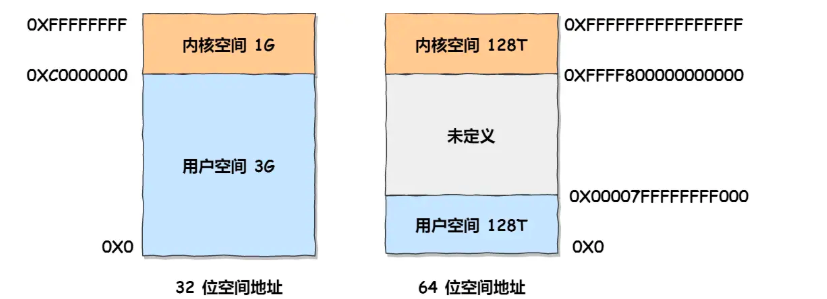

因为 32 位操作系统，进程最多只能申请 3 GB 大小的虚拟内存空间，所以进程申请 8GB会失败。

而64位系统则可以申请。


## 动态内存分配

程序运行时按需申请和释放内存的过程，堆(heap)上的内存分配与释放。

方法有：显式空闲链表，隐式空闲链表（在块头部包含块大小、是否分配），分离适配（多个链表）

## malloc

参考小林coding

#### 分配方式

malloc 申请内存的时候，会有两种方式向操作系统申请堆内存。

- 方式一：通过 brk() 系统调用从堆分配内存
- 方式二：通过 mmap() 系统调用在文件映射区域分配内存；

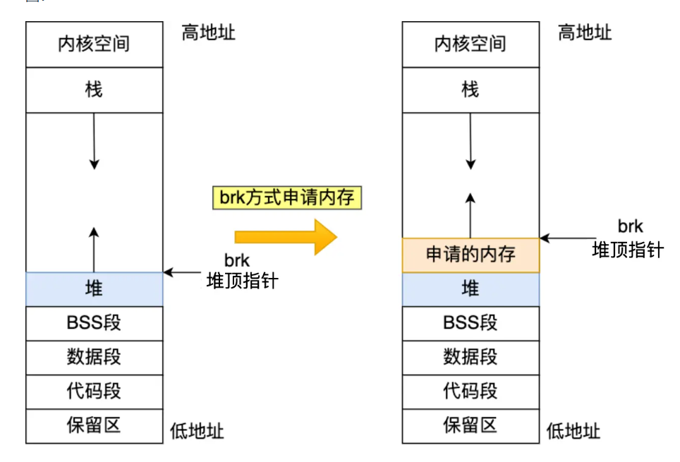

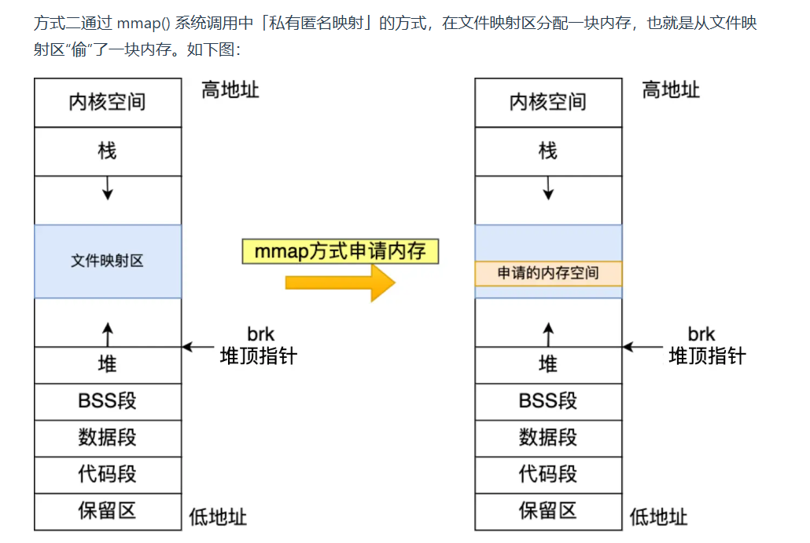

###### 两种方式何时使用

malloc() 源码里默认定义了一个阈值：

- 如果用户分配的内存小于 128 KB，则通过 brk() 申请内存；

* 如果用户分配的内存大于 128 KB，则通过 mmap() 申请内存；


#### malloc分配的是物理内存吗

不是的，**malloc() 分配的是虚拟内存**。

如果分配后的虚拟内存没有被访问的话，虚拟内存是不会映射到物理内存的，这样就不会占用物理内存了。

只有在访问已分配的虚拟地址空间的时候，操作系统通过查找页表，发现虚拟内存对应的页没有在物理内存中，就会触发缺页中断，然后操作系统会建立虚拟内存和物理内存之间的映射关系。

#### free释放之后会还给os吗

* malloc 通过 **brk()** 方式申请的内存，free 释放内存的时候，**并不会把内存归还给操作系统，而是缓存在 malloc 的内存池中，待下次使用**；
* malloc 通过 **mmap()** 方式申请的内存，free 释放内存的时候，**会把内存归还给操作系统，内存得到真正的释放**。

#### 为什么不全部使用 mmap 来分配内存？

向操作系统申请内存，是要通过系统调用的，执行系统调用是要进入内核态的，然后在回到用户态，运行态的切换会耗费不少时间。

所以，申请内存的操作应该避免频繁的系统调用，如果都用 mmap 来分配内存，等于每次都要执行系统调用。

另外，因为 mmap 分配的内存每次释放的时候，都会归还给操作系统，于是每次 mmap 分配的虚拟地址都是缺页状态的，然后在第一次访问该虚拟地址的时候，就会触发缺页中断。

通过 brk() 系统调用在堆空间申请内存的时候，由于堆空间是连续的，所以直接预分配更大的内存来作为内存池，当内存释放的时候，就缓存在内存池中。

**等下次在申请内存的时候，就直接从内存池取出对应的内存块就行了，而且可能这个内存块的虚拟地址与物理地址的映射关系还存在，这样不仅减少了系统调用的次数，也减少了缺页中断的次数**

#### free() 函数只传入一个内存地址，为什么能知道要释放多大的内存？

malloc 返回给用户态的内存起始地址比进程的堆空间起始地址多了 16 字节，保存了该内存块的描述信息，比如有该内存块的大小。


## 页面置换算法

先入先出

LRU 

## 内存交换和内存覆盖

内存交换(Swapping)和内存覆盖(Overlay)是两种经典的内存管理技术，它们都旨在解决程序运行空间大于实际可用物理内存的问题。

具有交换功能的操作系统中，通常把磁盘空间分为文件区和交换区两部分。

#### 交换空间

**交换空间（Swap Space）** 是计算机系统中用于扩展物理内存（RAM）的一种虚拟内存机制。当系统的物理内存不足时，操作系统会将部分暂时不用的数据从 RAM 移动到磁盘上的交换空间，以腾出 RAM 给更需要的进程使用。

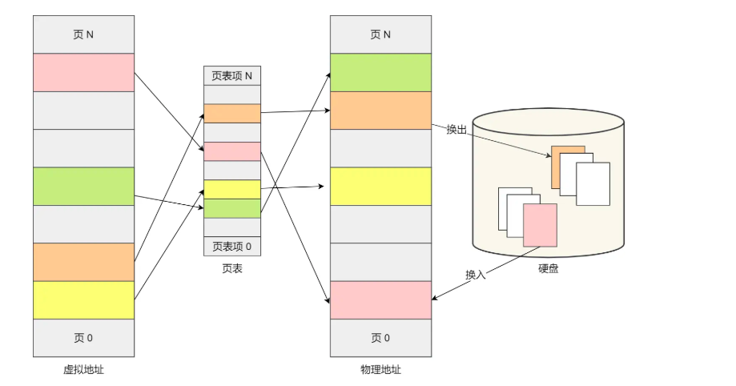

#### 内存交换

内存交换是操作系统层面的内存管理技术

当物理内存不足时，操作系统选择一些不活跃的进程，将他们的内存映像从物理内存移动到磁盘上的交换区(swap area)，释放出的物理内存分配给其他需要的进程

- 由操作系统自动管理，对应用程序透明
- 交换单位是整个进程的内存空间

#### 内存覆盖

内存覆盖是一种程序设计技术，需要程序员手动划分程序模块，使不需要同时执行的代码共享同一内存区域。


## 如何让进程在后台运行

1. shell中 命令加&后缀

2. ctrl+z挂起进程   jobs可以查看挂起的进程

## 外部中断和异常的区别

外部中断是由CPU外部设备或事件引发的，与当前执行的指令无关的**异步事件**。中断请求通常通过硬件信号线传递给CPU。

1. **I/O中断**：由输入/输出设备发出（如键盘输入、磁盘操作完成等）
2. **定时器中断**：由系统定时器周期性产生，用于时间片轮转调度

异常是**CPU执行指令过程中内部产生的同步事件**，通常与当前执行的指令直接相关

1. **陷阱(Trap)**：有意的异常，处理后继续执行下一条指令（如系统调用、断点）
2. **程序性异常**：如除零、溢出、非法内存访问等

## 进程  线程和协程区别

* 进程：进程是系统进⾏资源分配和调度的基本单位。  一个进程就是执行的程序和它的上下文（寄存器 内存映射信息-页表 堆栈  打开的文件表 占用的IO资源等   通过PCB保存了进程的很多信息：pid 父进程 ）。

  由于**每个进程都有独⽴的内存空间**，进程间互不干扰。

  **进程间上下文切换开销大，上下文信息多**，涉及内存复制，创建和销毁进程的开销较⼤，需要操作系统介入， 由操作系统调度。

* 线程：是进程内的执⾏单元，  线程的上下文内容较少（寄存器 线程栈   使用TCB记录信息：tid ）

  一个进程中可以同时存在多个线程，各个线程之间可以并发执行；

  各个线程之间可以共享地址空间和文件等资源；

  创建、切换线程比进程快，但仍需操作系统调度（抢占式）。

* 协程：用户态的轻量级线程，由**程序员控制调度**（非操作系统调度）。

  协程共享线程空间，仅保存少量寄存器状态（如栈指针、程序计数器），可在单线程内实现并发。

  协程主动让出 CPU（`yield`），由程序员决定何时切换。

####  区别

- 进程是资源（包括内存、打开的文件等）分配的单位，线程是 CPU 调度的单位；
- 进程拥有一个完整的资源平台，而线程只独享必不可少的资源，如寄存器和栈；

#### 线程的优点

线程相比进程能减少开销

* 线程的**创建时间比进程快**，因为进程在创建的过程中，还需要**资源管理信息，比如内存管理信息、文件管理信息**，而线程在创建的过程中，不会涉及这些资源管理信息，而是共享它们；
* 线程的**终止时间比进程快**，因为线程释放的资源相比进程少
* 同一个进程内的线程**切换比进程切换快**，因为线程具有相同的地址空间（虚拟内存共享），这意味着同一个进程的线程都**具有同一个页表**，那么在切换的时候不需要切换页表。
* 由于同一进程的各线程间共享内存和文件资源，那么在线程之间**数据传递**的时候，就**不需要经过内核**了，这就使得线程之间的数据交互效率更高了；

## 一个进程可以有多少线程

ulimit -a 这条命令，查看进程创建线程时默认分配的栈空间大小

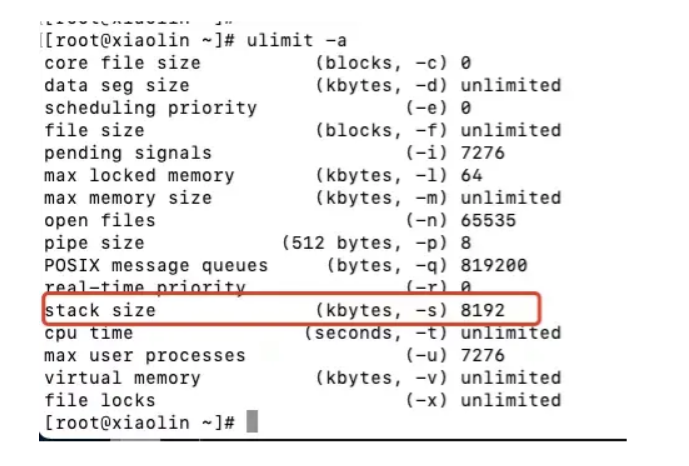

在 32 位 Linux 系统里，一个进程的虚拟空间是 4G，内核占1G，用户3G，线程栈大小为8MB：

```
理论最大线程数 = 可用虚拟空间 / 线程栈大小 = 3G/8M
```

## 如何回收线程

### C 语言

POSIX 线程库 (pthread) 是 C 语言中最常用的线程实现

1. `pthread_join` 是等待指定线程终止并回收其资源的主要方法

会阻塞调用线程，直到目标线程终止

2. 使用 `pthread_detach` 将线程标记为分离状态,线程结束时自动释放资源

### cpp

1. 使用 join() 方法回收线程

2. 使用 detach() 方法分离线程

## 僵尸进程和孤儿进程

孤⼉进程：⼀个⽗进程退出，⼀个或多个⼦进程还在运⾏。孤⼉进程将被**init进程(进程号为1)所收养**，并由init进程对它们完成状态收集⼯作。

僵⼫进程：⼀个进程使⽤fork创建⼦进程，如果⼦进程退出，⽽**⽗进程并没有调⽤wait或waitpid获取⼦进程**的状态信息，那么⼦进程的进程描述符仍然保存在系统中。这种进程称之为僵⼫进程。

## 进程调度算法

先来先服务

短作业优先

最短剩余时间优先

时间片轮转：将所有就绪进程排成一个队列，每次调度时，把 CPU 时间分配给队首进程

优先级调度 ：为每个进程分配一个优先级，按优先级进行调度。

#### 多级反馈序列

**多级反馈序列**：优先级+时间片，多个队列，每个队列的优先级不同，时间片也不同。

每个**队列优先级从高到低**，同时**优先级越高时间片越短**；

新的进程会被放入到第一级队列的末尾，按先来先服务的原则排队等待被调度，如果在第一级队列规定的时间片没运行完成，则将其转入到第二级队列的末尾；

当较高优先级的队列为空，才调度较低优先级的队列中的进程运行。如果进程运行时，有新进程进入较高优先级的队列，则停止当前运行的进程并将其移入到原队列末尾，接着让较高优先级的进程运行；

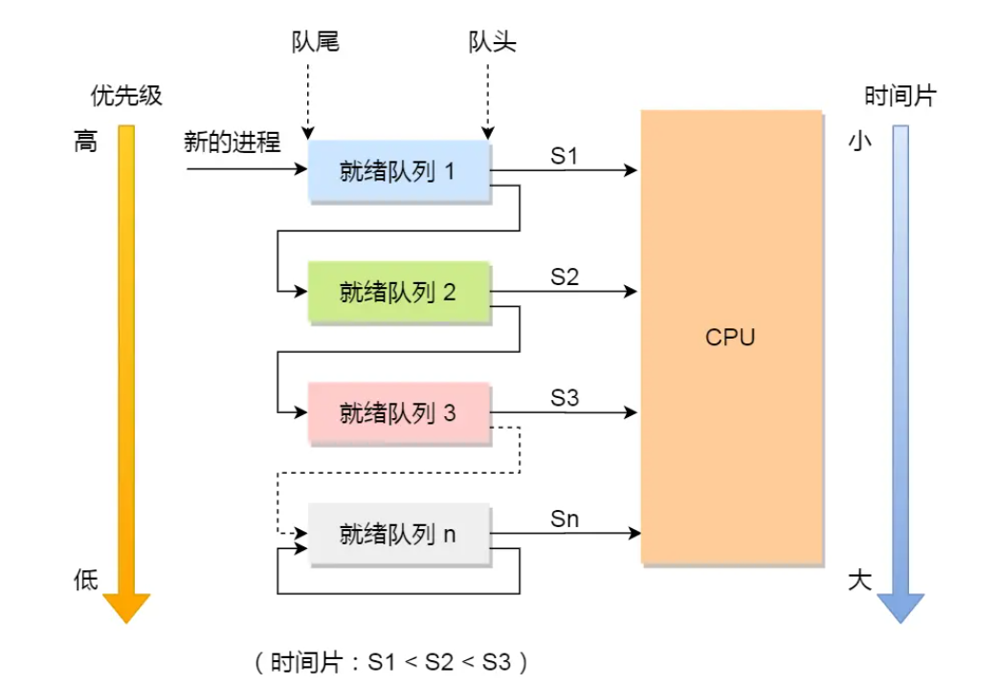

## 进程的状态

就绪：等待被调度

运行

阻塞：表示进程暂时无法执行，需要等待某个事件发生，例如：

I/O操作请求**是最常见的阻塞原因** 

等待子进程结束，父进程使用`wait()`或`waitpid()`等系统调用等待子进程终止时

进程在执行同步操作时，如等待信号量、互斥锁或条件变量，可能会进入阻塞状态

进程主动调用`sleep()`

进程等待接收特定的信号 `sigwait(&sigset, &sig)`

## 线程崩溃了，进程也会崩溃吗？

#### 线程非法访问 segmentation fault

一般来说如果线程是**因为非法访问内存引起的崩溃，那么进程肯定会崩溃**，因为在进程中，**各个线程的地址空间是共享的**，既然是共享，那么某个线程对地址的非法访问就会导致内存的不确定性，进而可能会影响到其他线程，这种操作是危险的。

```cpp
//针对只读内存写入数据
char *s = "hello world";
s[1] = 'H'; 
// 访问了进程没有权限访问的地址空间（比如内核空间）
int *p = (int *)0xC0000fff;
*p = 10; 
//访问了不存在的内存
int *a = NULL;
*a = 1;   
```

#### 线程使进程崩溃的机制-信号

 Linux 中可以通过 `kill -l`查看所有可用的信号

操作系统会为每个进程设置默认的信号处理行为，默认情况下，`SIGSEGV` 的处理方式是 **终止进程**并**生成核心转储（core dump）**。

```c++
#include <signal.h>
#include <stdio.h>

int main() {
    // 默认情况下，SIGSEGV 没有注册处理函数
    raise(SIGSEGV);  // 触发段错误，进程终止
    return 0;
}
```

- 当进程尝试访问未映射的虚拟地址或违反权限时，MMU（内存管理单元）触发 **缺页异常（Page Fault）** 或 **保护异常（Protection Fault）**。之后CPU 会跳转到内核的异常处理程序，内核确认访问权限不匹配，则发送 **SIGSEGV** 或 **SIGBUS**给进程，进程则终止。

## 进程间和线程间的通信

#### 进程通信

进程：由于**进程间相互隔离**，进程之间的通信需要使⽤⼀些特殊机制，如==管道、socket、信号、信号量、消息队列、共享内存==等。

##### 管道

* 匿名管道：用于**父子进程的通信**。 是⼀种半双⼯（可以A->B 或者B->A 但不能同时）的通信⽅式，数据只能单向流动⽽且只能在具有⽗⼦进程关系的进程间使⽤。 
  
  ```cpp
       int pipefd[2]; // pipefd[0]用于读，pipefd[1]用于写
       pipe(pipefd) 
  
   // 创建子进程
      pid = fork();
  
      if (pid < 0) {
          perror("fork");
          exit(EXIT_FAILURE);
      }
  
      if (pid == 0) { // 子进程
          // 关闭子进程中不需要的写端
          close(pipefd[1]);
  
          // 从管道读取数据
          int bytes_read = read(pipefd[0], buffer, sizeof(buffer));
  
          if (bytes_read > 0) {
              buffer[bytes_read] = '\0'; // 确保字符串以null结尾
              std::cout << "子进程收到消息: " << buffer << std::endl;
          }
  
          // 关闭读端
          close(pipefd[0]);
          exit(EXIT_SUCCESS);
      } else { // 父进程
          // 关闭父进程中不需要的读端
          close(pipefd[0]);
  
          // 向管道写入数据
          const char* message = "Hello from parent process!";
          write(pipefd[1], message, strlen(message));
  
          // 关闭写端
          close(pipefd[1]);
  
          // 等待子进程结束
          wait(NULL);
          std::cout << "父进程：子进程已退出" << std::endl;
  
          exit(EXIT_SUCCESS);
      }
  ```

* 命名管道：用于无关的进程的通信。可以使用`mkfifo`函数创建一个管道文件 然后一个进程写一个读
  
  ```
   const char* fifo_path = "/tmp/my_fifo";
   mkfifo(fifo_path, 0666) == -1)
     // 以写方式打开FIFO
   int fd = open(fifo_path, O_WRONLY);
   const char* message = "Hello through named pipe!";
   write(fd, message, strlen(message));th, O_WRONLY);
  ```

##### 信号

步骤：

- 注册信号处理函数
- 发送信号
- 在信号处理函数中执行相应操作

```
// 信号处理函数
 void signalHandler(int signum) {
 std::cout << "接收到信号: " << signum << std::endl;
 }

signal(SIGINT, signalHandler); // 注册SIGINT信号处理函数

kill(pid, SIGINT) // 向进程发送信号
```

**shell的实现使用了信号**

shell主进程注册了一堆信号处理函数SIGCHLD SIGINT SIGTSTP ctrl-c停止前台进程、ctrl-z挂起前台进程 且支持唤醒进程 等待前台进程完成

信号传递本质上是通过向进程发送一个**中断请求**的方式来实现的。利用`kill(pid,sig)`发送信号 。

##### socket

在**客户端和服务器**之间通信

##### 共享内存

**映射⼀段能被其他进程所访问的内存**，这段共享内存由⼀个进程创建，但多个进程都可以访问。

共享内存是**最快的进程通信⽅式**，它是针对其他进程间通信⽅式运⾏效率低⽽专⻔设计的。

它往往与其他通信机制，⽐如**信号量配合使⽤**，来实现进程间的同步和通信。

api: shm_open() mmap() munmap()

位置：共享内存的具体位置由操作系统决定，但通常，它会位于操作系统的**内核空间**，并映射到进程的**用户空间**中。

在Linux中，共享内存通常存储在如下位置：

- `/dev/shm/`：这个目录通常用于存放临时的共享内存文件，它是一个基于内存的文件系统，提供了进程间共享内存的支持。

`-lrt` 是编译器选项，用于在 Linux 系统中链接实时（**real-time**）库，它通常用于需要高精度定时、线程调度和消息队列等功能的程序。

```c++
/*
使用 shm_open 创建或打开共享内存对象。
使用 ftruncate 设置共享内存的大小（如果需要）。
使用 mmap 将共享内存映射到进程的虚拟地址空间。
进程通过映射的地址读写共享内存。
使用 munmap 和 shm_unlink 清理资源
shm_open 和其他与共享内存相关的函数位于 librt 中。因此，在编译时需要加上 -lrt 选项，以链接实时库。
*/


//  主进程
#include <iostream>
#include <unistd.h>
#include <fcntl.h>
#include <sys/mman.h>
#include <sys/stat.h>
#include <cstring>
#include <errno.h>

const char *SHM_NAME = "/my_shm";  // 共享内存的名称
const size_t SHM_SIZE = 1024;      // 共享内存大小

int main() {
  // 创建共享内存对象
  int shm_fd = shm_open(SHM_NAME, O_CREAT | O_RDWR, 0666);
  if (shm_fd == -1) {
      std::cerr << "shm_open failed: " << strerror(errno) << std::endl;
      return 1;
  }

  // 设置共享内存的大小
  if (ftruncate(shm_fd, SHM_SIZE) == -1) {
      std::cerr << "ftruncate failed: " << strerror(errno) << std::endl;
      return 1;
  }

  // 映射共享内存到当前进程地址空间
  void* ptr = mmap(NULL, SHM_SIZE, PROT_READ | PROT_WRITE, MAP_SHARED, shm_fd, 0);
  if (ptr == MAP_FAILED) {
      std::cerr << "mmap failed: " << strerror(errno) << std::endl;
      return 1;
  }

  // 在共享内存中写数据
  const char* message = "Hello from the parent process!";
  memcpy(ptr, message, strlen(message) + 1);

  std::cout << "Parent wrote: " << message << std::endl;

  // 等待子进程操作共享内存
  std::cout << "Press Enter to clean up..." << std::endl;
  std::cin.get();

  // 清理共享内存资源
  munmap(ptr, SHM_SIZE);
  close(shm_fd);
  shm_unlink(SHM_NAME);

  return 0;
}
```

```c++
#include <iostream>
#include <unistd.h>
#include <fcntl.h>
#include <sys/mman.h>
#include <sys/stat.h>
#include <cstring>
#include <errno.h>

// 额外进程
const char *SHM_NAME = "/my_shm";  // 共享内存的名称
const size_t SHM_SIZE = 1024;      // 共享内存大小

int main() {
    // 打开已经存在的共享内存对象
    int shm_fd = shm_open(SHM_NAME, O_RDONLY, 0666);
    if (shm_fd == -1) {
        std::cerr << "shm_open failed: " << strerror(errno) << std::endl;
        return 1;
    }

    // 映射共享内存到当前进程地址空间
    void* ptr = mmap(NULL, SHM_SIZE, PROT_READ, MAP_SHARED, shm_fd, 0);
    if (ptr == MAP_FAILED) {
        std::cerr << "mmap failed: " << strerror(errno) << std::endl;
        return 1;
    }

    // 从共享内存中读取数据
    std::cout << "Child read: " << (char*)ptr << std::endl;

    // 清理资源
    munmap(ptr, SHM_SIZE);
    close(shm_fd);

    return 0;
}
```

##### 信号量

PV操作    本质是**⼀个计数器**，一般是同⼀进程内**不同线程之间的同步⼿段**。    下面同步机制中介绍了API

##### 消息队列

消息队列是消息的链表，**存放在内核**中并由**消息队列标识符**标识。消息队列克服了信号传递信息少、管道只能承载⽆格式字节流以及缓冲区⼤⼩受限等缺点。

api: mq_open() mp_close() mp_send() mq_recieve()

消息队列有system v和posix多种实现  其中posix更现代

**可以使用 POSIX 消息队列**实现进程通信

POSIX 消息队列通过内存管理来存储消息，但它的名字以路径（如 `/myqueue`）的方式呈现，类似于一个命名管道或者共享内存。

内核会为每个消息队列分配一块内存区域，这些区域包含了消息队列的控制信息和实际的消息数据。

POSIX 消息队列通常使用 **链表** 或 **循环队列** 来管理消息。

```c++
/*
要使用 POSIX 消息队列，必须包含 <mqueue.h> 头文件，并链接时需要使用 -lrt 来链接实时库。
使用 mq_open() 创建一个消息队列
使用 mq_send() 向消息队列发送消息
另一个进程可以使用 mq_receive() 来从队列中接收消息。
使用 mq_close() 关闭消息队列
可以通过 mq_unlink() 删除队列。
*/

#include <iostream>
#include <mqueue.h>
#include <fcntl.h>
#include <sys/stat.h>
#include <cstring>
#include <unistd.h>

int main()
{
    // 设置消息队列属性
    struct mq_attr attr;
    attr.mq_flags = 0;      // 默认标志
    attr.mq_maxmsg = 10;    // 最大消息数
    attr.mq_msgsize = 1024; // 最大消息大小（1KB）
    attr.mq_curmsgs = 0;    // 当前队列中的消息数（可选）

    mqd_t mq = mq_open("/my_queue", O_CREAT | O_WRONLY, 0644, NULL);
    if (mq == (mqd_t)-1)
    {
        perror("mq_open");
        return 1;
    }

    // 发送多个消息
    const char *msg1 = "Message 1";
    const char *msg2 = "Message 2";
    const char *msg3 = "Message 3";

    mq_send(mq, msg1, strlen(msg1), 0); // 发送消息 1
    mq_send(mq, msg2, strlen(msg2), 0); // 发送消息 2
    mq_send(mq, msg3, strlen(msg3), 0); // 发送消息 3

    std::cout << "Messages sent." << std::endl;

    mq_close(mq);
    return 0;
}
```

```c++
#include <iostream>
#include <mqueue.h>
#include <fcntl.h>
#include <sys/stat.h>
#include <cstring>
#include <unistd.h>

int main()
{
    mqd_t mq = mq_open("/my_queue", O_RDONLY);
    if (mq == (mqd_t)-1)
    {
        perror("mq_open");
        return 1;
    }

    // 读取多个消息
    char buffer[10240];

    // 接收第一个消息
    if (mq_receive(mq, buffer, sizeof(buffer), NULL) == -1)
    {
        perror("mq_receive");
        return 1;
    }
    std::cout << "Received: " << buffer << std::endl;

    // 接收第二个消息
    if (mq_receive(mq, buffer, sizeof(buffer), NULL) == -1)
    {
        perror("mq_receive");
        return 1;
    }
    std::cout << "Received: " << buffer << std::endl;

    // 接收第三个消息
    if (mq_receive(mq, buffer, sizeof(buffer), NULL) == -1)
    {
        perror("mq_receive");
        return 1;
    }
    std::cout << "Received: " << buffer << std::endl;

    mq_close(mq);
    mq_unlink("/my_queue");

    return 0;
}
```

#### 线程通信

线程：由于线程**共享相同的内存空间**，它们之间可以**直接访问共享数据**，线程间通信更加⽅便  。

线程同步的机制有，互斥锁，读写锁，信号量，条件变量

## 线程安全

指的是在多线程环境下，多个线程对共享资源的访问**不会导致竞态条件（race condition）或未定义行为**。

竟态条件：由于访问和修改等操作的执行顺序不固定，因此**可能会导致不同的执行结果**

安全就是 ：执行结果可预测 且正确

#### 线程不安全的例子

参考csapp P716

1. 不保护共享变量的函数

2. 保持跨越多个调用的状态的函数
   
   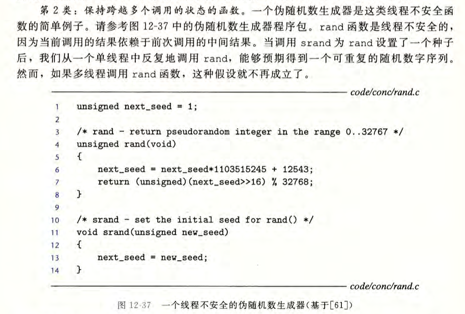

3. 返回指向静态变量的指针的函数  
   
   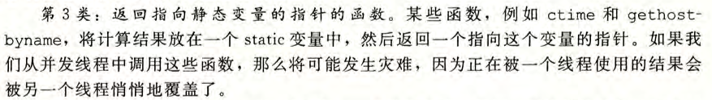

#### 如何保证线程安全

**共享资源访问使用锁，原子操作**  ；利用**线程局部存储**；

线程局部存储（Thread Local Storage）允许每个线程有自己的数据副本，避免多个线程之间的竞争。

- **`thread_local` 关键字**（C++11 引入）使得变量在每个线程中都有独立的副本，从而避免线程间共享数据时发生冲突。

```c++
#include <iostream>
#include <thread>

thread_local int counter = 0;  // 每个线程有独立的 counter

void increment() {
    counter++;
    std::cout << "Counter in thread: " << counter << std::endl;
}

int main() {
    std::thread t1(increment);
    std::thread t2(increment);

    t1.join();
    t2.join();

    return 0;
}
```

## 进程间切换

* os为进程分配pid和**PCB块**（task_struct  里面记录了pid **寄存器信息  打开文件表** 当前目录
   kernel_stack_ptr和user_stack_ptr[内核栈和用户栈栈顶指针]              ）  

* 虽然内核空间共享 但是 **每个进程有自己的内核栈 相互独立** 

### 发生系统调用时

主要是pc和sp的变化 pc从指向用户地址空间 到指向内核地址空间 ；sp也从用户栈到内核栈

进入内核模式前  内核保存用户空间的寄存器信息    （一般利用pcb保存，xv6使用struct proc 的trapframe保存） 

在执行内核代码时 会利用内核栈保存内核函数的信息（返回地址 局部变量等等）

因为在内核模式下也需要使用寄存器  pc sp 等 所以要将用户空间使用的寄存器保存

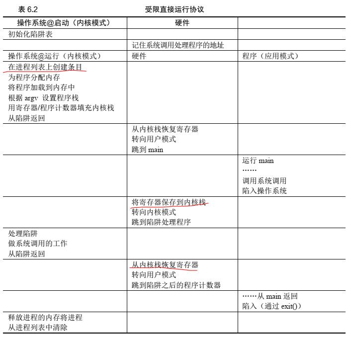

### 进程切换时

先进入内核空间，此时用户空间的寄存器信息保存到内核栈

（原进程的堆内容和栈内容 还在原来的物理页 但是有可能会被临时换出 换出的页保存在了交换空间）

（交换空间在磁盘上 是对物理内存的扩充）

然后 进入内核栈之后 执行switch_to 这是一个内核的函数 它会执行上下文切换 

具体来说是将当前的寄存器信息保存到PCB，然后从下一个进程的PCB块恢复新进程的寄存器信息

之后就是从内核空间返回 

注意：PCB和内核栈理论上都可以保存进程上下文信息  看怎么实现 可以相互配合

注意：上下文不仅包括进程在用户空间的状态信息还包括在内核空间的状态信息（寄存器 rip rsp等），这些都可保存在PCB中，以便于恢复。 

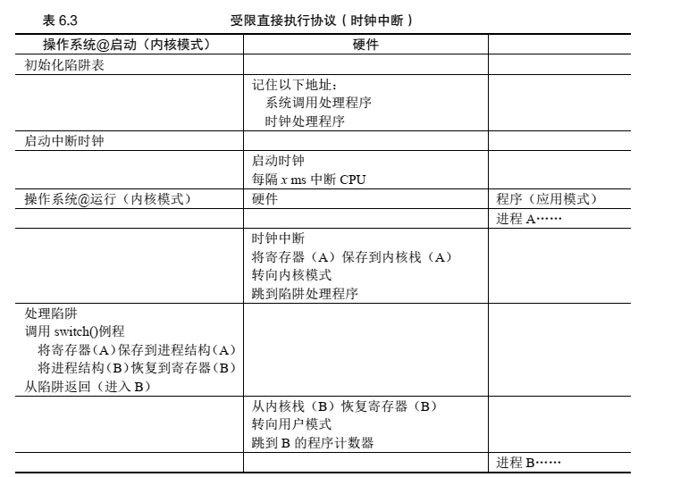

## 线程同步

意思就是协调线程的执行顺序  使之按预定的规则执行 

同步方式：互斥锁 读写锁 信号量 条件变量

## 进程同步

进程同步用的比较少，因为不同进程切换时开销较大，同步需要用到进程间通信。

## c与cpp中的同步机制  锁-条件变量-读写锁-原子操作

### 简单介绍：

锁  : mutex  加锁解锁包住临界区    cpp会在`std::lock_guard`析构时释放锁 或者手动释放`std::unique_lock`

信号量  :    P wait  -1         V  post   +1 

条件变量  ：条件变量用于阻塞线程（当不满足条件时） 配合锁使用

## 锁

互斥锁  读写锁 条件变量 自旋锁（Busy on wait)

## c的进程相关api

在 C 语言中，线程和同步机制通常通过 **POSIX 线程库（pthread）** 来实现。`pthread` 是 UNIX-like 系统中常见的线程库

```c
// 线程相关api
pthread_create()：创建一个新线程。
pthread_exit()：终止线程的执行。
pthread_join()：等待线程执行完毕。
pthread_self()：获取当前线程的线程 ID。
// 锁相关
pthread_mutex_init()：初始化互斥锁。
pthread_mutex_destroy()：销毁互斥锁。
pthread_mutex_lock()：加锁。
pthread_mutex_unlock()：解锁。
pthread_mutex_trylock()：尝试加锁，失败时返回错误。
// 读写锁    
pthread_rwlock_init()：初始化读写锁。
pthread_rwlock_destroy()：销毁读写锁。
pthread_rwlock_rdlock()：获取读锁。
pthread_rwlock_wrlock()：获取写锁。
pthread_rwlock_unlock()：释放锁。
// 信号量
sem_init()：初始化信号量。
sem_destroy()：销毁信号量。
sem_wait()：信号量 P 操作，等待信号量变为正值并减少它。
sem_post()：信号量 V 操作，增加信号量。
sem_getvalue()：获取信号量的当前值。
// 条件变量
pthread_cond_init()：初始化条件变量。
pthread_cond_destroy()：销毁条件变量。
pthread_cond_wait()：等待条件变量满足条件，并释放互斥锁。
pthread_cond_signal()：通知一个等待的线程。
pthread_cond_broadcast()：通知所有等待的线程。
```

| 功能   | c                                   | cpp                                                 |
| ---- | ----------------------------------- | --------------------------------------------------- |
| 线程创建 | `pthread_create()`                  | `std::thread`                                       |
| 线程终止 | `pthread_exit()` / `pthread_join()` | `std::thread::join()`                               |
| 互斥锁  | `pthread_mutex_*()`                 | `std::mutex`                                        |
| 读写锁  | `pthread_rwlock_*()`                | `std::shared_mutex`                                 |
| 信号量  | `sem_*()`                           | `std::counting_semaphore` / `std::binary_semaphore` |
| 条件变量 | `pthread_cond_*()`                  | `std::condition_variable`                           |
| 原子操作 | 无（可以用 `pthread` 原语模拟）               | `std::atomic`                                       |

## cpp的进程相关api

```cpp
std::thread：创建并管理线程。
std::thread::join()：等待线程完成。
std::thread::detach()：分离线程，线程在后台独立执行。

std::mutex：互斥锁对象。
std::lock_guard：RAII 风格的互斥锁管理器，自动加锁和解锁。
std::unique_lock：更灵活的锁管理，支持显式解锁和延迟加锁。
std::mutex::lock()：加锁。
std::mutex::unlock()：解锁。
std::mutex::try_lock()：尝试加锁

std::shared_mutex：读写锁。
std::shared_lock：读锁。
std::unique_lock：写锁。

std::condition_variable：条件变量。
std::condition_variable_any：可以与任意锁类型一起使用的条件变量（如 std::mutex、std::shared_mutex）。
std::condition_variable::wait()：等待条件变量满足。
std::condition_variable::notify_one()：通知一个等待的线程。
std::condition_variable::notify_all()：通知所有等待的线程。

std::atomic：提供原子操作（如 load、store、fetch_add 等）。
std::atomic::exchange()：交换值。
std::atomic::compare_exchange_weak()：比较并交换。

std::counting_semaphore：计数信号量。
std::binary_semaphore：二值信号量。
std::counting_semaphore::acquire()：获取信号量。
std::counting_semaphore::release()：释放信号量。
```

### 1.  `std::mutex` 用于进行互斥

`std::mutex` 是 C++ 中最基础的同步工具，确保**临界区的互斥访问**，即在同一时刻只能有一个线程进入临界区。

#### 基本用法：`std::mutex` 与 `std::lock_guard`

```c++
#include <iostream>
#include <thread>
#include <mutex>

std::mutex mtx;  // 定义互斥锁

// 保证按序执行   print_id不可以并发执行
void print_id(int id) {
    std::lock_guard<std::mutex> lock(mtx);  // 自动获取锁
    // 临界区：只有一个线程可以访问
    std::cout << "Thread " << id << " is working\n";
    std::this_thread::sleep_for(std::chrono::milliseconds(1000));  // 模拟线程执行时间
    std::cout << "Thread " << id << " is working after unlock\n";
    // 锁在lock对象离开作用域时自动释放
}

int main() {
    std::thread t1(print_id, 1);
    std::thread t2(print_id, 2);

    t1.join();
    t2.join();

    return 0;
}
```

- `std::lock_guard<std::mutex>` 会自动锁定 `mtx`，当 `lock_guard` 对象超出作用域时，它会自动释放锁，从而确保互斥。
- 这种方式简单且不容易出错，通常推荐在临界区保护较小代码块时使用。

#### 使用 `std::unique_lock`

如果需要更复杂的锁操作，如延迟加锁、手动解锁或重新加锁，可以使用 `std::unique_lock`：

```c++
#include <iostream>
#include <thread>
#include <mutex>
#include <chrono>

std::mutex mtx;  // 定义互斥锁

//pirnt_id可以并发执行，互不影响
void print_id(int id) {
    std::unique_lock<std::mutex> lock(mtx);  // 获取锁
    std::cout << "Thread " << id << " is working\n";
    lock.unlock();  // 手动解锁
    std::this_thread::sleep_for(std::chrono::milliseconds(1000));  // 模拟线程执行时间
    std::cout << "Thread " << id << " is working after unlock\n";
    // 锁在unique_lock离开作用域时自动释放
}

int main() {
    std::thread t1(print_id, 1);
    std::thread t2(print_id, 2);

    t1.join();
    t2.join();

    return 0;
}
```

### 2. **读写锁（`std::shared_mutex`）**

如果你的临界区代码中有读多写少的情况，即多个线程可以同时读取共享数据，但只有一个线程可以写入，那么使用读写锁会更高效。

- **`std::shared_mutex`** 允许多个线程同时读取（共享锁），但在写操作时必须独占访问（独占锁）。
- **`std::shared_lock`**：用于获取共享锁（多个线程可同时获取共享锁）。
- **`std::unique_lock`**：用于获取独占锁。

#### 示例：读写锁

```c++
#include <iostream>
#include <thread>
#include <mutex>
#include <shared_mutex>

std::shared_mutex rw_mutex;  // 定义读写锁
int shared_data = 0;

void read_data(int id) {
    std::shared_lock<std::shared_mutex> lock(rw_mutex);  // 共享锁，允许多个线程并行读取
    std::cout << "Reader " << id << " read shared_data: " << shared_data << std::endl;
    std::this_thread::sleep_for(std::chrono::milliseconds(1000));  // 模拟线程执行时间

}

void write_data(int id) {
    std::unique_lock<std::shared_mutex> lock(rw_mutex);  // 独占锁，只有一个线程可以写
    shared_data++;
    std::cout << "Writer " << id << " wrote shared_data: " << shared_data << std::endl;
    std::this_thread::sleep_for(std::chrono::milliseconds(1000));  // 模拟线程执行时间
}

int main() {
    std::thread readers[5];
    std::thread writers[5];

    // 启动线程
    for (int i = 0; i < 5; ++i) {
        readers[i] = std::thread(read_data, i + 1);
        writers[i] = std::thread(write_data, i + 1);
    }

    // 等待所有线程完成
    for (auto& th : readers) {
        th.join();
    }
    for (auto& th : writers) {
        th.join();
    }

    return 0;
}
```

- `std::shared_lock` 允许多个线程同时读取共享资源，而 `std::unique_lock` 在写时锁定资源。
- 读操作不会互斥，可以并行执行，写操作需要独占访问。

### 3. **条件变量（`std::condition_variable`）**

当你需要更复杂的同步控制，比如线程需要等待某个条件发生时（如缓冲区是否为空），可以使用 **条件变量**。条件变量允许线程在某个条件不满足时进入等待状态，直到其他线程通知它条件已满足。

**`wait(lock, predicate)`**,   `wait` 的作用是，先检查condition，若为false，则：

1. **释放锁**：让出当前持有的互斥锁（`std::mutex` 或 `std::unique_lock`），允许其他线程修改共享数据。
2. **进入阻塞状态**：线程暂停执行，直到被唤醒（通过 `notify_one()` 或 `notify_all()`）或发生虚假唤醒（spurious wakeup）, 如果被虚假唤醒，会再次检查 `condition`，如果仍然是 `false`，则继续等待。。
3. **重新获取锁**：当线程被唤醒后，它会尝试重新获取锁，然后继续执行后续代码。

#### 示例：生产者消费者模型

```c++
#include <iostream>
#include <thread>
#include <mutex>
#include <condition_variable>
#include <queue>
#include <chrono>

const int MAX_BUFFER_SIZE = 10;  // 缓冲区的最大容量
std::queue<int> buffer;          // 用于存放生产的数据
std::mutex mtx;                  // 互斥锁，保护缓冲区
std::condition_variable cv;      // 条件变量，用于同步生产者和消费者

// 生产者函数
void producer(int id) {
    int product = 0;
    while (true) {
        std::this_thread::sleep_for(std::chrono::milliseconds(1000));  // 模拟生产时间
        std::unique_lock<std::mutex> lock(mtx);

        // 等待直到缓冲区有空间
        cv.wait(lock, []() { return buffer.size() < MAX_BUFFER_SIZE; });

        // 生产一个产品并放入缓冲区
        buffer.push(product);
        std::cout << "Producer " << id << " produced: " << product << std::endl;
        product++;  // 下一个产品编号

        // 通知消费者可以消费
        cv.notify_all();
    }
}

// 消费者函数
void consumer(int id) {
    while (true) {
        std::this_thread::sleep_for(std::chrono::milliseconds(1500));  // 模拟消费时间
        std::unique_lock<std::mutex> lock(mtx);

        // 等待直到缓冲区有产品可以消费
        cv.wait(lock, []() { return !buffer.empty(); });

        // 消费一个产品
        int product = buffer.front();
        buffer.pop();
        std::cout << "Consumer " << id << " consumed: " << product << std::endl;

        // 通知生产者可以生产
        cv.notify_all();
    }
}

int main() {
    const int num_producers = 3;
    const int num_consumers = 3;

    // 创建生产者线程
    std::vector<std::thread> producers;
    for (int i = 0; i < num_producers; ++i) {
        producers.push_back(std::thread(producer, i + 1));
    }

    // 创建消费者线程
    std::vector<std::thread> consumers;
    for (int i = 0; i < num_consumers; ++i) {
        consumers.push_back(std::thread(consumer, i + 1));
    }

    // 等待线程完成（实际上这些线程会一直运行）
    for (auto& p : producers) {
        p.join();
    }
    for (auto& c : consumers) {
        c.join();
    }

    return 0;
}
```

- `std::condition_variable::wait()` 会让线程进入等待状态，直到被其他线程通过 `notify_all()` 或 `notify_one()` 唤醒。
- 在生产者线程中，生产一个数据项并通知消费者；在消费者线程中，等待直到有数据可消费。

### 4. **原子操作（`std::atomic`）**

如果你只需要对一些简单类型的数据（如整数）进行访问控制，并且需要高效的无锁同步，可以使用 **原子操作**。`std::atomic` 提供了一组无锁的操作，它可以确保对共享变量的访问是原子性的，不需要使用显式的锁。

#### 示例：使用 `std::atomic`

```c++
#include <iostream>
#include <thread>
#include <atomic>

std::atomic<int> counter(0);  // 定义原子变量

void increment() {
    for (int i = 0; i < 1000; ++i) {
        counter.fetch_add(1, std::memory_order_relaxed);  // 原子操作：递增
    }
}

int main() {
    std::thread t1(increment);
    std::thread t2(increment);

    t1.join();
    t2.join();

    std::cout << "Counter: " << counter.load() << std::endl;  // 输出：Counter: 2000
    return 0;
}
```

- 无需使用显式的互斥锁，原子变量内部已经通过硬件支持了线程安全。 

## 读写者 生产者-消费者 哲学家问题  及应用场景

#### 生产者-消费者模型

#### 读者写者


#### 哲学家


```

```

## 何时使用多线程 何时使用多进程

频繁修改：需要频繁创建和销毁的优先使用多线程

相关性：任务间相关性比较强的用多线程，相关性比较弱的用多进程。因为线程之间的数据共享和同步比较简单。

## 死锁

死锁是指多个进程（或线程）在执行中，因争夺资源而互相等待

举例：有线程A、B，资源1、2，线程A先对资源1加锁后对2加锁，但是在A请求资源2之前，线程切换到B，而B对资源2加锁之后请求资源1，于是A和B互相等待，都无法继续运行。

#### 条件

互斥条件：资源一个时刻只能被一个线程使用。

请求和保持：进程请求新资源时，如果新资源被占用，进程会进入阻塞，不会释放已有资源。

不可剥夺：进程获得的资源未使用完时，不能被剥夺。

循环等待：多个进程形成一个闭环链路，都在等待下个进程持有的资源。

#### 预防

资源可被同时使用。（不安全

要么一次性获得所有资源，要么都不获得。

请求新资源时，如果不被满足，设置超时时间，超时释放已有资源。

协调线程执行顺序，避免循环等待。

## 并发和并行

**并行是指在同一时刻真正同时执行多个任务的能力**，必须有多核或多处理器

**并发是指在同一时间段内能够处理多个任务的能力**，单核处理器，通过任务切换实现。

并发看起来像是"同时"在做多件事，但实际上任意时刻只在处理一件事。

## 文件系统 inode

### 目录  

目录内容叫目录项

通常， 文件系统将目录视为特殊类型的文件。因此，目录有一个 inode，位于 inode 表中的某处（ inode 表中的 inode 标记为“目录”的类型字段，而不是“常规文件”）。该目录具有由 inode 指向的数据块（也可能是间接块）。  

在类 Unix 文件系统（如 ext4）中，目录项通常存储在目录文件中，而实际的文件元数据则存储在 `inode` 结构中。

### inode

在每个 inode 中，实际上是所有关于文件的信息：文件类型（例如，常规文件、目录等）、大小、分配给它的块数、保护信息（如谁拥有该文件以及谁可以访问它）、一些时间信息（包括文件创建、修改或上次访问的时间文件下），以及有关其数据块驻留在磁盘上的位置的信息（如某种类型的指针）。我们将所有关于文件的信息称为元数据（ metadata）  

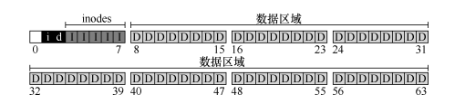

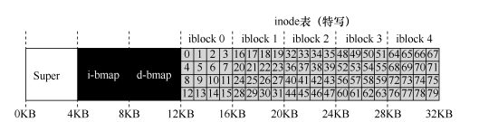

上图是 VSFS 的 inode 表：大小为 20KB （ 5 个 4KB 块），因此由 80 个 inode（假设每个 inode 为 256 字节）组成。进一步假设 inode区域从 12KB 开始（即超级块从 0KB 开始， inode 位图在 4KB 地址，数据位图在 8KB，因此 inode 表紧随其后）。

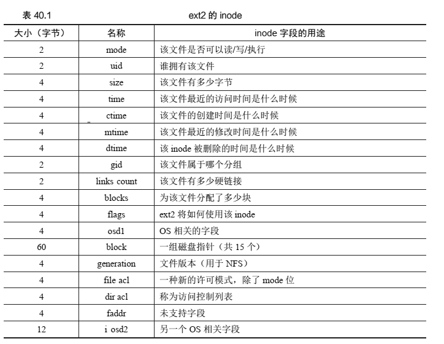

### 例子

当你发出一个 open("/foo/bar", O_RDONLY)调用时，文件系统首先需要找到文件 bar 的inode，从而获取关于该文件的一些基本信息（权限信息、文件大小等等）。为此，文件系统必须能够找到 inode，但它现在只有完整的路径名。文件系统必须遍历路径名，从而找到所需的 inode。

所有遍历都从文件系统的根开始，即根目录（ root directory），它就记为/。因此，文件系统的第一次磁盘读取是根目录的 inode。但是这个 inode 在哪里？要找到 inode，我们必须知道它的 i-number。 通常， 我们在其父目录中找到文件或目录的 i-number。 根没有父目录（根据定义）。因此，**根的 inode 号必须是“众所周知的**”。在挂载文件系统时，文件系统必须知道它是什么。在大多数 UNIX 文件系统中，根的 inode 号为 **2**。因此，要开始该过程，文件系统会读入 inode 号 2 的块（第一个 inode 块）。

一旦 inode 被读入，文件系统可以在其中**查找指向数据块的指针，数据块包含根目录的内容**。因此，文件系统将使用这些磁盘上的指针来读取目录，在这个例子中，寻找 foo 的条目。通过读入一个或多个目录数据块，它将找到 foo 的条目。一旦找到，文件系统也会找到下一个需要的 foo 的 inode 号（假定是 44）。

下一步是递归遍历路径名，直到找到所需的 inode。在这个例子中，文件系统读取包含foo 的 inode 及其目录数据的块， 最后找到 bar 的 inode 号。 open()的最后一步是将 bar 的 inode读入内存。然后文件系统进行最后的权限检查，在每个进程的打开文件表中，为此进程分配一个文件描述符，并将它返回给用户。

打开后，程序可以发出 read()系统调用，从文件中读取。第一次读取（除非 lseek()已被调用，则在偏移量 0 处）将在文件的第一个块中读取，查阅 inode 以查找这个块的位置。它也会用新的最后访问时间更新 inode。读取将进一步更新此文件描述符在内存中的打开文件表，更新文件偏移量，以便下一次读取会读取第二个文件块，等等。

## 软链接和硬链接

硬链接：同一个inode，只是多个名字。
软链接：是不同的文件，inode不同

硬链接删除增加会影响链接数，软链接不会，因为inode不一样。

硬链接无法创建目录硬链接，软链接可以

硬链接没有主次之分，相互独立
软链接依赖于原文件，原文件被删除，软链接即不可用

#### 硬链接

由于linux下的文件是通过索引节点（Inode）来识别文件，硬链接可以认为是一个指针，指向文件索引节点的指针，系统并不为它重新分配inode。每添加一个一个硬链接，文件的链接数就加1。

硬连接之间没有主次之分，删除某个硬链接，只是**将其从目录的数据块中删除相关信息，并且文件链接数减一**。不会从inode表中删除inode,除非只剩下一个链接数。

```shell
#创建文件夹hardlink
[root@localhost ~]# mkdir /hardlink
#在hardlink内创建文件aa.txt
[root@localhost hardlink]# touch aa.txt
#查看其链接数为1
#注意，此处链接数就是硬链接的次数
[root@localhost hardlink]# ls -il
total 0
51190844 -rw-r--r--. 2 root root 0 Feb  2 13:04 aa.txt
#创建硬链接
[root@localhost hardlink]# ln aa.txt  aa.link
[root@localhost hardlink]# ls -il
total 0
51190844 -rw-r--r--. 2 root root 0 Feb  2 13:04 aa.link
51190844 -rw-r--r--. 2 root root 0 Feb  2 13:04 aa.txt
#往aa.txt文件中写入一些内容
[root@localhost hardlink]# echo "123" >aa.txt
#发现aa.link中也同样可以看到
[root@localhost hardlink]# cat aa.txt 
123
[root@localhost hardlink]# cat aa.link 
123
#删除aa.txt
[root@localhost hardlink]# rm -f aa.txt 
#aa.link依然可以正常查看内容
[root@localhost hardlink]# cat aa.link 
123
#l链接数 -1，inode不变
[root@localhost hardlink]# ls -il
total 4
51190844 -rw-r--r--. 1 root root 4 Feb  2 14:00 aa.link
```

#### 软链接

（又称符号链接，即 soft link 或 symbolic link）：**相当于 Windows 中的快捷方式，即如果你软链接一个目录，只是一个目录的快捷方式到指定位置，操作系统找这个快捷方式会直接找到真实目录下的文件。**

```shell
[root@localhost ~]# mkdir /softlink
[root@localhost ~]# cd /softlink/
[root@localhost softlink]# touch aa.txt
#创建软链接
[root@localhost softlink]# ln -s aa.txt  soft.link
[root@localhost softlink]# ls -il
total 0
1156025 -rw-r--r--. 1 root root 0 Feb  2 15:12 aa.txt
1156029 lrwxrwxrwx. 1 root root 6 Feb  2 15:13 soft.link -> aa.txt
```

软连接与原文件并不是同一inode，链接数也没有增加

**因为软链接的inode指向的数据块保存的是 原文件的路径，如果没有路径，只有文件名，默认会在软链接所在路径查找**

## ASCII Unicode UTF-8

1. **ASCII**：最早的字符编码标准，仅包含128个字符
2. **Unicode**：包含世界上几乎所有字符的字符集，定义了字符和码点的映射关系
3. **UTF-8**：Unicode的一种编码实现方式，规定了如何将Unicode码点转换为字节序列

| Unicode码点范围        | UTF-8编码方式                           | 字节数 |
| ------------------ | ----------------------------------- | --- |
| U+0000 - U+007F    | 0xxxxxxx                            | 1   |
| U+0080 - U+07FF    | 110xxxxx 10xxxxxx                   | 2   |
| U+0800 - U+FFFF    | 1110xxxx 10xxxxxx 10xxxxxx          | 3   |
| U+10000 - U+10FFFF | 11110xxx 10xxxxxx 10xxxxxx 10xxxxxx | 4   |

## 什么是零拷贝


## 什么是一致性哈希

