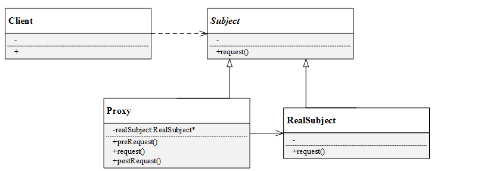
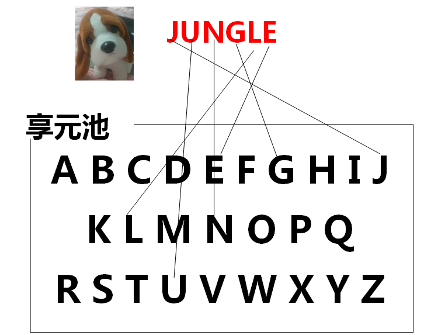

# 设计模式汇总

参考[FengJungle/DesignPattern: Design pattern demo code](https://github.com/FengJungle/DesignPattern/tree/master)  和“大话设计模式”

### 原则

开闭原则：软件实体（类、模块、函数）应该可以扩展，但不能修改。

单一职责原则：就一个类而言，应该只有一个引起类变化的原因。

依赖倒转原则：高层模块不应该依赖底层模块，而应该依赖抽象。比如，cpu、内存不依赖具体的主板，而是定义好接口。


里氏代换原则：即子类必须能够替换掉他们的父类。

迪米特法则：类应该尽量降低成员的访问权限；类之间应该尽量松耦合。越是弱耦合的类被修改，对其他类的影响越小。

合成聚合原则：优先使用聚会、合成，而不是继承，避免继承层次规模太大。


### 简单工厂模式

创建型模式关注对象的创建过程，在软件开发中应用非常广泛。

创建型模式描述如何**将对象的创建和使用分离**，**让用户在使用对象过程中无须关心对象的创建细节，从而降低系统耦合度，并且让系统易于修改和扩展**。

**简单工厂模式：**

```
定义一个简单工厂类，它可以根据参数的不同返回不同类的实例，被创建的实例通常都具有共同的父类
```

从简单工厂模式的定义和例子可以看出，在简单工厂模式中，大体上有3个角色：

- **工厂（Factory）**：根据客户提供的具体产品类的参数，创建具体产品实例；
- **抽象产品（AbstractProduct）**：具体产品类的基类，包含创建产品的公共方法；
- **具体产品（ConcreteProduct）**：抽象产品的派生类，包含具体产s品特有的实现方法，是简单工厂模式的创建目标。 简单工厂模式UML类图如下：


例子：


### 策略模式

```
同样是排序算法，你可以选择冒泡排序、选择排序、插入排序、快速排序等等，也即是说，为了实现排序这一个目的，有很多种算法可以选择。这些不同的排序算法构成了一个算法族，你可以在需要的时候，根据需求或者条件限制（内存、复杂度等）适时选择具体的算法。
```

在面向对象的设计里，该如何设计这样一个算法族呢？它包含了多种算法，在使用的时候又会根据条件来选择具体的算法？这就会用到软件设计模式中的——策略模式。

策略模式用于算法的自由切换和扩展，对应于解决某一问题的一个算法族，允许用户从该算法族中任意选择一个算法解决问题，同时还可以方便地更换算法或者增加新的算法。策略模式将算法族中的每一个算法都封装成一个类，每一个类称为一个策略（Strategy）。

```
策略模式：
定义一系列算法，将每一个算法封装起来，并让它们可以相互替换。策略模式让算法可以独立于使用它的客户而变化。
```

为了方便算法族中的不同算法在使用中具有一致性，在策略模式中会提供一个抽象层来声明公共接口，在具体的策略类中实现各个算法。策略模式由上下文类和策略类组成，其UML结构如下图：


- Context（上下文类） ：上下文类是使用算法的角色，可以在解决不同具体的问题时实例化不同的具体策略类对象；
- Strategy（抽象策略类）：声明算法的方法，抽象层的设计使上下文类可以无差别的调用不同的具体策略的方法；
- ConcreteStrategy（具体策略类）：实现具体的算法。

### 装饰模式

```
成都的气温说降就降啊！还没立冬呢，温度骤然下降，只有10度了。扛不住了，Jungle要穿一件毛衣！
额，出门还是很冷！那再带个围巾！
天，上半身不冷了，下半身还那么冷~~~穿上秋裤！
出门前想了想，这种天气骑摩拜单车一定吹着手冷，于是Jungle又带上了手套……
看到了吗，天冷了，Jungle想加什么衣裤即加什么衣裤，各种装饰让Jungle不再感到寒冷。不过，不管Jungle穿再多衣服，Jungle始终还是那个Jungle，那个生活在成都的狗子，这一点是不变的！
```

看到上面的例子了吗？这就是装饰模式的典型应用，**穿戴再多服饰并不会改变Jungle的本质，但穿戴会让Jungle更加温暖和帅气，满足Jungle冷天出行的需求**。在软件设计中，对已有对象的功能进行扩展，以获得更加符合用户需求的对象，使得对象具有更加强大的功能，这就是装饰模式。

**装饰模式可以在不改变一个对象本身功能的基础上给对象增加额外的新行为**，比如手机，为防止摔坏，可以给手机贴膜或者带上保护套；为美观，可以在保护套上贴卡通贴纸；为便于携带可以增加挂绳，如下图。但这并不改变手机的本质。

```
装饰模式：
动态地给一个对象增加一些额外的职责。就扩展功能而言，装饰模式提供了一种比使用子类更加灵活的替代方案。 
```

装饰模式是一种用于替代继承的技术。通过一种无须定义子类的方式给对象动态增加职责，使用对象之间的关联关系取代类之间的继承关系。装饰模式中引入了装饰类，在装饰类中既可以调用待装饰的原有对象的方法，还可以增加新的方法，以扩充原有类的功能。

装饰模式的结构如图所示：	


装饰模式中有如下角色：

- Component（抽象构件）：是具体构件类和装饰类的共同基类，声明了在具体构件中定义的方法，客户端可以一致的对待使用装饰前后的对象；
- ConcreteComponent（具体构件）：具体构件定义了构件具体的方法，装饰类可以给它增加更多的功能；
- Decorator（抽象装饰类）：**用于给具体构件增加职责，但具体职责在其子类中实现**。**抽象装饰类通过聚合关系定义一个抽象构件的对象**，通过该对象可以调用装饰之前构件的方法，并通过其子类扩展该方法，达到装饰的目的；
- ConcreteDecorator（具体装饰类）： 向构件增加新的功能。

### 代理模式

代理模式在软件设计中广泛应用，而且产生的变种很多，如远程代理、虚拟代理、缓冲代理、保护代理等。

```
代理模式：
给某一个对象提供一个代理或占位符，并由代理对象来控制对原对象的访问。
```

代理模式是一种对象结构型模式，在该模式中引入了一个代理对象，在客户端和目标访问对象之间起到中介的作用。代理对象可以屏蔽或删除客户不想访问的内容和服务，也可以根据客户需求增加新的内容和服务。

代理模式的关键是代理类（Proxy）。代理模式中引入了抽象层，客户端针对抽象层编程，这样使得客户端可以一致对待真实对象和代理对象。代理模式主要有**抽象主题角色（Subject）**、**代理主题角色（(Proxy)**和**真实主题角色（RealSubject）**组成，其UML图如下：



- **抽象主题角色（Subject）**：声明了代理主题角色和真实主题角色共同的一些接口，因此在任何可以使用真实主题对象的地方都可以使用代理主题角色（想一想代购是不是也是这样？），客户端通常针对抽象主题编程；
- **代理主题角色（Proxy）**：代理主题角色通过关联关系引用真实主题角色，因此可以控制和操纵真实主题对象；代理主题角色中提供一个与真实主题角色相同的接口（以在需要时代替真实主题角色），同时还可以在调用对真实主题对象的操作之前或之后增加新的服务和功能；
- **真实主题角色（RealSubject）**：真实主题角色是代理角色所代表的真实对象，提供真正的业务操作，客户端可以通过代理主题角色间接地调用真实主题角色中定义的操作。

在实际开发过程中，代理模式产生了很多类型：

- 远程代理（Remote Proxy）：为一个位于不同地址空间的对象提供一个本地的代理对象。不同的地址空间可以在相同或不同的主机中。
- 虚拟代理（Virtual Proxy）：当创建一个对象需要消耗大量资源时，可以先创建一个消耗较少资源的虚拟代理来表示，当真正需要时再创建。
- 保护代理（Protect Proxy）：给不同的用户提供不同的对象访问权限。 缓冲代理（Cache Proxy）：为某一个目标操作的结果提供临时存储空间，以使更多用户可以共享这些结果。
- 智能引用代理（Smart Reference Proxy）：当一个对象被引用时提供一些额外的操作，比如将对象被调用的次数记录下来等。

### 工厂方法模式

简单工厂模式存在最大的问题是违背了“开闭原则”，每当增加新的产品时，需要修改工厂类的逻辑。

从工厂方法模式简介中，可以知道该模式有以下几种角色：

- **抽象工厂（AbstractFactory）**：所有生产具体产品的工厂类的基类，提供工厂类的公共方法；
- **具体工厂（ConcreteFactory）**：生产具体的产品
- **抽象产品（AbstractProduct）**：所有产品的基类，提供产品类的公共方法
- **具体产品（ConcreteProduct）**：具体的产品类 工厂方法模式UML类图如下


客户端声明一个抽象工厂，并用具体工厂对其实例化。

### 原型模式

原型模式通过复制一个已有对象来获取更多相同或者相似的对象。原型模式定义如下：

```
原型模式：

使用原型实例指定待创建对象的类型，并且通过复制这个原型来创建新的对象。
```

原型模式的工作原理是将一个原型对象传给要发动创建的对象（即客户端对象），这个要发动创建的对象通过**请求原型对象复制自己来实现创建过程**。从工厂方法角度而言，创建新对象的工厂就是原型类自己。软件系统中有些对象的创建过程比较复杂，且有时需要频繁创建，原型模式通过给出一个原型对象来指明所要创建的对象的类型，然后用复制这个原型对象的办法创建出更多同类型的对象，这就是原型模式的意图所在（构造过程比较复杂，使用复制原型代替构造）。


### 模板方法

模板方法模式是较简单且常用的一种设计模式，是基于类的继承的一种代码复用技术，其结构只存在基类和派生类之间的继承关系。模板方法是一个具体的方法，给出了一个顶层逻辑流程框架。

```
模板方法模式：
定义一个操作中的算法的框架，而将一些步骤延迟到子类中。模板方法模式使得子类可以不改变一个算法的结构即可重定义该算法的某些特定步骤。
```

模板方法的结构很简单，只有基类和派生类两个角色：

- AbstractClass（基类）：即抽象类，在基类中定义或声明了一系列基本操作method，这些操作是具体或者抽象的，每一个操作都对应算法的一个步骤，在其派生类中可以重定义。基类中定义了一个模板方法（template method），它规定了算法的流程框架，模板方法由基类定义或声明的一系列基本操作按照一定流程实现。
- ConcreteClass（派生类）：实现在基类中声明的抽象方法，也可以覆盖在基类中已经实现的方法。

模板方法模式的UML图如下：


### 外观模式

外观模式是一种使用频率较高的设计模式，它提供一个外观角色封装多个复杂的子系统，简化客户端与子系统之间的交互，方便客户端使用。外观模式可以降低系统的耦合度。如果没有外观类，不同的客户端在需要和多个不同的子系统交互，系统中将存在复杂的引用关系，如下图。引入了外观类，原有的复杂的引用关系都由外观类实现，不同的客户端只需要与外观类交互。


```
外观模式：
为子系统中的一组接口提供一个统一的入口。外观模式定义了一个高层接口，这个接口使得这一子系统更加容易使用。
```

外观模式的应用很多，比如浏览器，用户要查找什么东西，不论是浏览知乎、腾讯或者CSDN，用户都只需要打开浏览器即可，剩下的搜索工作由浏览器完成。

外观模式的UML结构图如下所示：


外观模式一共有以下角色：

- **Facade（外观角色）**：外观角色可以知道多个相关子系统的功能，它将所有从客户端发来的请求委派给相应的子系统，传递给相应的子系统处理。
- **SubSystem（子系统角色）**：子系统是一个类，或者由多个类组成的类的集合，它实现子系统具体的功能。

### 建造者模式

建造者模式将客户端与包含多个部件的复杂对象的创建过程分离，客户端不必知道复杂对象的内部组成方式与装配方式（就好像Jungle不知道到底是如何把大象装进冰箱一样），只需知道所需建造者的类型即可。

```
建造者模式：

将一个复杂对象的构建与它的表示分离，使得同样的构建过程可以创建不同的表示。
```

建造者模式的结构包含以下几个角色：

- **抽象建造者（AbstractBuilder）**：创建一个Product对象的各个部件指定的抽象接口；
- **具体建造者（ConcreteBuilder）**：实现AbstractBuilder的接口，实现各个部件的具体构造方法和装配方法，并返回创建结果。
- **产品（Product）**：具体的产品对象
- **指挥者（Director）**： 构建一个使用Builder接口的对象，安排复杂对象的构建过程，**客户端一般只需要与Director交互，指定建造者类型，然后通过构造函数或者setter方法将具体建造者对象传入Director**。它主要作用是：隔离客户与对象的生产过程，并负责控制产品对象的生产过程。


### 观察者模式

软件系统中的对象并不是孤立存在的，一个对象行为的改变可能会引起其他所关联的对象的状态或行为也发生改变，即“牵一发而动全身”。观察者模式建立了一种**一对多的联动，一个对象改变时将自动通知其他对象，其他对象将作出反应**。观察者模式中，发生改变的对象称为“观察目标”，被通知的对象称为“观察者”。一个观察目标可以有很多个观察者。

观察者模式定义如下：

```
观察者模式：
定义对象之间的一种一对多的依赖关系，使得每当一个对象状态发生改变时，其相关依赖对象都得到通知并被自动更新。
```

观察者模式又被称为发布-订阅模式（Publish-Subscribe）、模型-视图模式（Model-View）、源-监听器模式（Source-Listener）、从属者模式（Dependents）。

观察者模式由观察者和观察目标组成，为便于扩展，两个角色都设计了抽象层。观察者模式的UML图如下：


- **Subject（目标）**：是被观察的对象，目标中定义了一个观察者的集合，即一个目标可能会有多个观察者，通过attach()和detach()方法来增删观察者对象。目标声明了通知方法notify()，用于在自身状态发生改变时通知观察者。
- **ConcreteSubject（具体目标）**：具体目标实现了通知方法notify()，同时具体目标有记录自身状态的属性和成员方法；
- **Observer（观察者）**：观察者将对接收到的目标发生改变的通知做出自身的反应，抽象层声明了更新方法update()；
- **ConcreteObserver（具体观察者）**： 实现了更新方法update()，具体观察者中维护了一个具体目标对象的引用（指针），用于存储目标的状态。

### 抽象工厂模式

抽象工厂模式定义：

```
抽象工厂模式：

提供一个创建一系列相关或相互依赖对象的接口，而无需指定他们具体的类。
```


简言之，**一个工厂可以提供创建多种相关产品的接口，而无需像工厂方法一样，为每一个产品都提供一个具体工厂。**

象工厂模式结构与工厂方法模式结构类似，不同之处在于，一个具体工厂可以生产多种同类相关的产品：

- **抽象工厂（AbstractFactory）**：所有生产具体产品的工厂类的基类，提供工厂类的公共方法；
- **具体工厂（ConcreteFactory）**：生产具体的产品
- **抽象产品（AbstractProduct）**：所有产品的基类，提供产品类的公共方法
- **具体产品（ConcreteProduct）**：具体的产品类
  抽象工厂模式UML类图如下：


例子：

```
Jungle想要进行户外运动，它可以选择打篮球和踢足球。
但这次Jungle不想弄脏原本穿的T恤，所以Jungle还需要穿球衣，打篮球就穿篮球衣，踢足球就穿足球衣。
篮球保管室可以提供篮球和篮球衣，足球保管室可以提供足球和足球衣。
Jungle只要根据心情去某个保管室，就可以换上球衣、拿上球，然后就可以愉快地玩耍了。
```


### 状态模式

状**态模式将一个对象的状态从对象中分离出来，封装到专门的状态类中，使得对象状态可以灵活变化**。对于客户端而言，无需关心对象转态的转换以及对象所处的当前状态，无论处于何种状态的对象，客户端都可以一致处理。

```
状态模式：
允许一个对象在其内部状态改变时改变它的行为。对象看起来似乎修改了它的类。
```


状态模式引入了抽象层，具有抽象状态类和具体状态类，还包括一个上下文境类:

- **Context（上下文类）**：是拥有多种状态的对象。上下文类的状态存在多样性，并且在不同的状态下，对象表现出不同的行为。在上下文类中，维护了一个抽象状态类的实例。
- **State（抽象状态类）**：声明了一个接口，用于封装与在上下文类中的一个特定状态相关的行为，在子类中实现在各种不同状态对应的方法。不同的子类可能存在不同的实现方法，相同的方法可以写在抽象状态类中。
- **ConcreteState（具体状态类）**：实现具体状态下的方法，每一个具体状态类对应一个具体的状态。

例子：

```
在某纸牌游戏中，游戏人物分为入门级（primary）、熟练级（Secondary）、高手级（Professional）和骨灰级（Final）四种级别，由人物的积分来划分角色等级，游戏胜利将增加积分，失败将扣除积分。入门级有最基本的游戏功能play()，熟练级增加了游戏胜利积分加倍功能doubleScore()，高手级在熟练级的基础上增加了换牌功能changeCards()，骨灰级在高手级的基础上再增加了偷看他人纸牌的功能peekCards()。
积分规则如下：
基础分：100，游戏胜利+50分，游戏失败+30分；
入门级：0~150；熟练级150~200；
高手级：200~250；
骨灰级：250以上
```

等级作为状态，状态提供update方法进行状态转移


### 适配器模式

除了网卡适配器，你一定还听说过电源适配器吧？我国生活用电电压是220V，但我们的电脑、手机、平板、剃须刀（充电式）不会使用这么高的电压。这就需要电源适配器（充电器、变压器），使各个电子设备和220的供电电压兼容。电源适配器就充当了一个适配器的角色。

在软件系统设计中，**当需要组合使用的类不兼容时，也需要类似于变压器一样的适配器来协调这些不兼容者**，这就是适配器模式！

那么什么是适配器模式呢？

```
适配器模式：

将一个类的接口转换成客
户希望的另一个接口。适配器模式让那些接口不兼容的类可以一起工作。
```


与电源适配器类似，适配器模式中会设计一个叫做“**适配器**”的包装类，适配器包装的对象叫做**适配者**。根据定义，适配器是根据客户的需求，将适配者已有的接口转换成另一个接口，得以使不兼容的类可以协同工作。

适配器模式分为类适配器和对象适配器。

- 适配器类（Adapter）：适配器与适配者之间是继承或实现关系；
- 适配者类（Adaptee）：适配器与适配者之间是关联关系。
- 目标抽象类（Target）：定义客户所需要的接口。

类适配器和对象适配器的UML图如下。**类适配器中，适配器类通过继承适配者类**，并重新实现适配者的具体接口来达到适配客户所需要的接口的目的。**对象适配器中，适配器类通过在类中实例化一个适配者类的对象**，并将其封装在客户所需功能的接口里，达到最终的适配目的。


例子：

```
路径规划包括两个阶段：首先读取并解析工程图文件，得到其中的点、直线坐标；其次根据需求计算加工路径。软件控制器（Controller）上，系统点击“路径规划”按钮就自动完成上述过程。
Jungle已经封装好一个类DxfParser，该类可以读取后缀名为dxf的工程图文件，并解析其中的点、线，保存到路径列表里。另一个类PathPlanner用于计算加工路径。
```

这个例子中，Controller就是目标抽象类，DxfParser和PathPlanner是适配者类，这两个类提供的方法可以用于实现路径规划的需求。我们只需再定义一个适配器类Adapter即可，其适配Controller的接口。


### 备忘录模式

```
“Ctrl+Z”是什么操作？各位都用过，并且经常使用吧？撤销！撤销上一个操作返回上一个状态，甚至撤销好几个操作，返回到几个操作之前的状态。这个操作非常有用，一旦我们某一步操作失误，可以选择撤销操作来返回原来的无错状态。
那么系统怎么知道每一步的状态呢？它一定保存了一定数量的历史状态！就像Git版本控制一样，保存着每一次提交的状态，使用者可以随时reset到历史某个状态，就像一个备忘录一样，保存了某些阶段的状态。
```

类似于上述引言的例子，在软件系统的操作过程中，难免会出现一些不当的操作，使得系统状态出现某些故障。如果能够有一种机制——**能够保存系统每个阶段的状态，当用户操作失误的时候，可以撤销不当的操作，回到历史某个阶段**——那么软件系统将更加灵活和人性化。

有没有这样的一种解决方案呢？有！那就是备忘录模式。备忘录模式提供了一种状态恢复的机制，用户可以方便地回到指定的某个历史状态。很多软件的撤销操作，就使用了备忘录模式。

```
备忘录模式：
在不破坏封装的前提下捕获一个对象的内部状态，并在该对象之外保存这个状态，这样可以在以后将对象恢复到原先保存的状态。 
```


备忘录模式主要有以下角色：

- **Originator（原发器）**：通过创建一个备忘录类存储当前的内部状态，也可以使用备忘录来恢复其内部状态，通常是将系统中需要保存内部状态的类设计为原发器；
- **Memento（备忘录）**：用于存储原发器的内部状态。备忘录的设计可以参考原发器的设计，根据需要确定备忘录类中的属性；**除了原发器类对象，不允许其他对象修改备忘录**。
- **Caretaker（负责人）**：负责保存备忘录，可以存储一个或多个备忘录对象，但是负责人只负责保存对象，不能修改对象，也不必知道对象的实现细节。（看好了，负责人可以存储多个备忘录对象，想一想这有什么用？是不是可以保存多个历史状态？实现多步撤销操作了）

例子：

打游戏，打boss前保存游戏角色的状态

### 组合模式

组合模式关注包含叶子节点和容器节点的结构以及他们构成的组织形式。这样的组织形式的特点在于：叶子节点不再包含成员对象，而容器节点可以包含成员对象，这些对象可以是叶子节点，也可以是容器节点。这些节点通过不同的**递归组合**形成一个树形结构。好比**Windows系统的目录结构，文件夹里包含文件和子文件夹，子文件夹里还可以包含文件和文件夹**


组合模式为叶子节点和容器节点提供了公共的抽象构建类，客户端无需关心所操作的对象是叶子节点还是容器节点，只需针对抽象构建类编程处理即可。

```
组合模式定义：

组合多个对象形成树形结构以表示具有部分-整体关系的层次结构。组合模式让客户端可以统一对待单个对象和组合对象。
```


结合引言及组合模式UML图可知组合模式有如下角色：

- Component（抽象构件）：Component是一个抽象类，定义了构件的一些公共接口，这些接口是管理或者访问它的子构件的方法（如果有子构件），具体的实现在叶子构件和容器构件中进行。
- - Leaf（叶子构件）：它代表树形结构中的叶子节点对象，叶子构件没有子节点，它实现了在抽象构件中定义的行为。对于抽象构件定义的管理子构件的方法，叶子构件可以通过抛出异常、提示错误等方式进行处理。 Composite（容器构件） ：容器构件一方面具体实现公共接口，另一方面通过聚合关系包含子构件，子构件可以是容器构件，也可以是叶子构件。 结合公司组织架构的例子，各个分级部门是容器构件，类似于Jungle的员工是叶子构件；结合Windows目录结构，文件夹是容器构件，可以包含子文件夹和文件，而文件则是叶子构件，不能再包含子构件。

### 迭代器模式

遍历在日常编码过程中经常使用，通常是需要对一个具有很多对象实例的集合（称为**聚合对象**）进行访问或获取。比如要取聚合对象的首位元素、判断是否在聚合对象的末尾等。针对聚合对象的遍历，迭代器模式是一种很有效的解决方案，也是一种使用频率很高的设计模式。

```
迭代器模式：
提供一种方法顺序访问一个聚合对象中的各个元素，而又不暴露该对象的内部表示。
```


通过引入迭代器，可以将数据的遍历功能从聚合对象中分离出来，这样一来，聚合对象只需负责存储数据，而迭代器对象负责遍历数据，使得聚合对象的职责更加单一，符合单一职责原则。

迭代器模式结构中包含聚合和迭代器两个层次的结构。为方便扩展，迭代器模式常常和工厂方法模式结合。迭代器模式的UML图如下。有图可知，迭代器模式有以下几个角色：

- **Iterator（抽象迭代器）**：声明了访问和遍历聚合对象元素的接口，如first()方法用于访问聚合对象中第一个元素，next()方法用于访问下一个元素，hasNext()判断是否还有下一个元素，currentItem()方法用于获取当前元素。
- **ConcreteIterator（具体迭代器）**：实现抽象迭代器声明的方法，通常具体迭代器中会专门用一个变量（称为游标）来记录迭代器在聚合对象中所处的位置。
- **Aggregate（抽象聚合类）**：用于存储和管理元素对象，声明一个创建迭代器的接口，其实是一个抽象迭代器工厂的角色。
- **ConcreteAggregate（具体聚合类）**：实现了方法createIterator()，该方法返回一个与该具体聚合类对应的具体迭代器ConcreteIterator的实例。

​	

### 单例模式

单例模式定义：

```
单例模式：
确保一个类只有一个实例，并提供一个全局访问点来访问这个唯一实例。
```


单例模式有3个要点：

- 这个类只能有一个实例；
- 它必须自己创建这个实例；
- 它必须自己向整个系统提供这个实例。

例模式结构非常简单，其UML图如下所示，只包含一个类，即单例类。为防止创建多个对象，其构造函数必须是私有的（外界不能访问）。另一方面，为了提供一个全局访问点来访问该唯一实例，单例类提供了一个公有方法getInstance来返回该实例


##### 考虑线程安全

###### 饿汉式：类一加载就创建（即程序启动时就创建）

双重保护+mutex互斥锁

```c++
#ifndef __SINGLETON_H__
#define __SINGLETON_H__
 
#include <iostream>
#include <string.h>
#include <mutex>
using namespace std;
 
class Singleton
{
public:
	static Singleton* getInstance(){
		if (instance == NULL){
			m_mutex.lock();
			if (instance == NULL){
				printf("创建新的实例\n");
				instance = new Singleton();
			}
			m_mutex.unlock();
		}
		return instance;
	}
private:
	Singleton(){}
 	
	static Singleton* instance;
	static std::mutex m_mutex;
};
 
Singleton* Singleton::instance = NULL;
std::mutex Singleton::m_mutex;
 
#endif //__SINGLETON_H__
```

下面是更简单的方式 使用static局部承成员变量

```c++
#ifndef __SINGLETON_H__
#define __SINGLETON_H__

class Singleton {
public:
    static Singleton& getInstance() {
        static Singleton instance;  // C++11 保证线程安全
        return instance;
    }

    Singleton(const Singleton&) = delete;
    Singleton& operator=(const Singleton&) = delete;

private:
    Singleton() = default;
    ~Singleton() = default;
};

#endif //__SINGLETON_H__
```


###### 懒汉式：类的实例第一次被使用时才创建

```c++
#ifndef __SINGLETON_H__
#define __SINGLETON_H__
 
#include <iostream>
#include <string.h>
using namespace std;
 
class Singleton
{
public:
	static Singleton& getInstance(){
		return instance;
	}
private:
	Singleton(){}
 
	static Singleton instance;
};
 
Singleton* Singleton::instance);
 
#endif //__SINGLETON_H__
```

### 桥接模式

```
Jungle有两个手机，分别是M手机和N手机，M手机上有游戏Game1，N手机上有Game2。每次Jungle想玩Game1时，就使用M手机，想玩Game2时，就玩N手机。要是某天Jungle外出，心情大好，两个游戏都想玩，那Jungle还得带上两个手机？？？麻不麻烦？
如果新出一个游戏Game3，那Jungle是不是要再买一个手机呢？
同样都是游戏软件，为什么不把所有游戏都装到一个手机上
```


如果系统中的某个类存在两个独立变化的维度，通过桥接模式可以将这两个维度分离开来，使两者独立扩展。如同上述实例，Jungle想用手机玩游戏，手机和游戏是两个独立变化的维度，增加一个游戏对手机没有影响，增加一个手机对游戏也没有影响。**手机上可以安装游戏，而游戏必须在手机上玩，从这个角度而言，手机和游戏之间存在较强的耦合**。

但两者可以很好的解耦，且解耦后扩展灵活：所有游戏安装在一个手机上，新出一个游戏，新安装就ok！买了新手机，同样可以装上所有游戏。这就是桥接模式：

```
桥接模式：

将抽象部分与它的实现部分解耦，使得两者都能够独立变化。
```


**桥接模式将两个独立变化的维度设计成两个独立的继承等级结构（而不会将两者耦合在一起形成多层继承结构），在抽象层将二者建立起一个抽象关联，该关联关系类似一座桥，将两个独立的等级结构连接起来**，故曰“桥接模式”。


- Abstraction（抽象类）：定义抽象类的接口（抽象接口），由聚合关系可知，抽象类中包含一个Implementor类型的对象，它与Implementor之间有关联关系，既可以包含抽象业务方法，也可以包含具体业务方法；
- Implementor（实现类接口）：定义实现类的接口，这个接口可以与Abstraction类的接口不同。一般而言，实现类接口只定义基本操作，而抽象类的接口还可能会做更多复杂的操作。
- RefinedAbstraction（扩充抽象类）：具体类，实现在抽象类中定义的接口，可以调用在Implementor中定义的方法； ConcreteImplementor（具体实现类）：具体实现了Implementor接口，在不同的具体实现类中实现不同的具体操作。运行时ConcreteImplementor将替换父类。

简言之，在Abstraction类中维护一个Implementor类指针，需要采用不同的实现方式的时候只需要传入不同的Implementor派生类就可以了。

例子：

以引言中的故事为例，Jungle学习了桥接模式后大受启发，想实现如下操作：

```
新手机上能够迅速在新手机上安装（setup）并玩（play）游戏

新增加一个游戏时Jungle能够在已有手机上安装并play
```


在这个实例里，手机是**抽象类Abstraction**，具有玩游戏这样的**实现类接口Implementor**，不同的手机品牌**扩充抽象类RefinedAbstraction**，多个不同的游戏则是**具体实现类ConcreteImplementor**。


### 命令模式

命令模式可以将请求（命令）的发送者与接收者完全解耦，发送者与接收者之间没有直接引用关系，发送请求的对象只需要知道如何发送请求，而不必知道请求是如何完成的。下面是比较晦涩难懂的命令模式的定义：

```
命令模式：
将一个请求封装为一个对象，从而可用不同的请求对客户进行参数化，对请求排队或者记录请求日志，以及支持可撤销的操作。
```

命令模式的定义比较复杂，也提到一些术语。这些将在下面的阐述和举例中做进一步说明。


命令模式的UML结构如上图，命令模式一共有以下几种角色：

- Command（抽象命令类）：是一个抽象类，声明了用于执行命令的接口execute()。
- ConcreteCommand（具体命令类）：具体的命令类，**实现了执行命令的接口execute()，它对应具体的接收者对象，将接收者（Receiver）的动作action()绑定其中**。在execute()方法中将调用接收者的动作action()。（这就是定义中的“将请求封装成一个对象”的体现）
- Invoker（调用者）：请求的发送者，通过命令对象来执行请求。一个调用者不需要在设计时确定其接收者，所以调用者通过聚合，与命令类产生关联。具体实现中，可以将一个具体命令对象注入到调用者中，再通过调用具体命令对象的execute()方法，实现简介请求命令执行者（接收者）的操作。
- Receiver（接收者）： 实现处理请求的具体操作（action）。

例子：

 	

### 职责链模式

```
应项目需求，公司安排Jungle去成都出差一段时间。这不，Jungle刚结束出差生活，回到公司准备报销。算了一下，Jungle一共有大概50万的一笔小额票据需要报销。按照公司规定，Jungle得先去找自己的组长签字。
组长一看，“啧啧啧，我只能处理10万金额以下的报销，你这单子我签个字，你还得找兵哥（主管）签字”，于是Jungle又跑去找兵哥。
兵哥看了，“啧啧啧，我最多只能管金额不超过30万的单子，你得找春总（经理）签字”。Jungle又不厌其烦地找到了春总。
春总一看，“呵，50万，不少啊！但60万以下我都能做主，这单子我给你签了！要是超过60万，你这狗子还得去找老板！”Jungle总算松了一口气，一级一级网上找领导，也是不容易呀！
```


在单位，每个领导都有不同的审批权限，不同额度的报销单层层上报，最终到有权处理该金额范围的领导手里，该单子才算审批完成。这是Jungle所在的公司（相信也是大部分公司）的制度。如果要用代码来模拟这种制度，有没有一种模式可以参考呢？

答案是：有！那就是职责链模式！

职责链模式又叫责任链模式。很多情况下，可以处理某个请求的对象可能不止一个，请求可以沿着某一条对象之间形成的关系一级一级由下家传递到上家，形成一条链——职责链。职责链可以是直线，也可以是环或树形结构。常见的职责链形式是直线。**链上的每一个对象都是请求的处理者，客户端要做的仅仅是发送请求，不需要关心请求的处理细节过程。由此，职责链模式将请求者和请求的接收者解耦**。

职责链模式定义如下：

```
职责链模式：
避免将一个请求的发送者和接收者耦合在一起，让多个对象都有机会处理请求。将接收请求的对象连接成一条链，并且沿着这条链传递请求，直到有一个对象能够处理它为止。
```


职责链模式中一共包含两个角色:

- **Handler（抽象处理者）**：抽象处理者一般为抽象类，声明了一个处理请求的接口handleRequest()，**定义了一个抽象处理者类型的对象，作为其对下家的引用**，通过该引用可以形成一条责任链。
- **ConcreteHandler（具体处理者）**： 是抽象处理者的子类，实现了处理请求的接口。在具体的实现中，如果该具体处理者能够处理该请求，就处理它，否则将该请求转发给后继者。具体处理者可以访问下一个对象。 由上述可知，在职责链模式中很多对象由每一个对象对其下家的引用连接起来形成一条链条，请求在这个链条上逐级传递，知道某一级能够处理这个请求为止。**客户端不知道也不必知道是哪一级处理者处理了该请求，因为每个处理者都有相同的接口handleRequest()**。接下来通过一个实例来进一步认识职责链模式。

### 中介者模式

```
介者模式：
定义一个对象来封装一系列对象的交互。中介者模式使各个对象之间不需要显示地相互引用，从而使其耦合松散，而且用户可以独立地改变它们之间的交互。
```

如果一个系统里各个对象之间存在多对多的相互关系，可以将对象之间的一些交互行为从各个对象中分离出来，集中封装在一个中介者对象中，使其耦合松散，并由中介者统一协调。通过中介者，对象之间的多对多关系就简化了相对更简单的一对多关系。


由图可知，中介者模式主要有以下角色：

- **Mediator（抽象中介者）**：声明一个用于与各个同事对象之间交互的接口，通常声明一个注册方法，用于增加同事对象；
- **ConcreteMediator（具体中介者）**：实现上面的接口，协调各个同事对象来实现协作行为，维持对各个同事对象的引用；
- **Colleague（抽象同事类）**：声明各个同事类公有的接口，同时维持了一个对抽象中介者类的引用；
- **ConcreteColleague（具体同事类）**： 具体实现接口，具体同事类只需与中介者通信，通过中介者完成与其他同事类的通信。

**中介者模式的核心在于引入了中介者类**，中介者类承担了两个层次的职责：

- 结构上起**中转作用**：通过中介者的中转，各个同事之间不必再相互显示调用或引用，只需通过中介者实现间接调用的目的；
- 行为上起**协调作用**：中介者可以进一步地将同事之间的关系进行封装，同事可以一致地和中介者进行交互，而不必指出中介者具体该如何操作，中介者根据封装在自身内部的协调逻辑对同事的请求进一步处理，将同事成员之间的关系行为进行分离和封装。

例子：


```
离开学校参加工作之前，你一定是有一段时间是在找租，Jungle也是如此。
Jungle为了找到合适的房子，沿着地铁线一个小区一个小区的去问门卫问保安，或者照着小区门口展板上的房东的联系方式去找房东……此事已经过去大半年了，但Jungle现在想来还是觉得很麻烦！麻烦在哪里？得亲自走亲自联系各个房东，通信录和微信得加好多房东……
其实有更省事的办法，那就是找中介，租房中介哪儿都是。虽然贵（主要原因），但是的确为租客省了很多事，其实也为房东省了很多事。
```

```
Jungle和贱萌兔想要通过房屋中介（Agency）租房，需要去中介处了解房东（Landlord）的信息（姓名，价格，地址和联系方式）；房东们（Landlord）需要在中介处注册自己的房源，同时也可以从中介处了解租客（Tenant）的信息（姓名）。
```


### 享元模式

```
知道围棋吗？不会下围棋那总见过吧？四四方方的棋盘上，白色棋子和黑色棋子分布在棋盘的各个位置上。
棋子与棋子之间的区别是什么？除了颜色和位置，好像没什么不同了吧！也就是说，每个棋子对象的大部分状态都是一样的（形状、材料、质地等）。如果我们要设计一个程序来实现下围棋的功能，该如何来创建或者表示这上百个棋子对象呢？
```

类似的，你想输入一段英文段落，无论每个单词再长再复杂，也无非都是由26个字母中的几个组成的。上述两个示例的共同点在于，**整个环境中存在大量相同或者相似的、需要重复使用的对象**。针对这样的场景，面向对象设计中有一类值得借鉴的设计模式是不错的解决方案——享元模式

如果一个系统在运行时创建太多相同或者相似的对象，会占用大量内存和资源，降低系统性能。**享元模式通过共享技术实现相同或相似的细粒度对象的复用，提供一个享元池存储已经创建好的对象，并通过享元工厂类将享元对象提供给客户端使用**。

```
享元模式：
运用共享技术有效地支持大量细粒度对象的复用。
```

**享元模式要求被共享的对象必须是细粒度对象**。如上面提到的输入英文段落的例子，26个字母可能随时被客户重复使用。尽管每个字母可能出现的位置不一样，但在物理上它们共享同一个对象（同一个实例）。利用享元模式，可以创建一个存储26个字母对象的享元池，需要时从享元池中取出。

	

享元对象能够做到共享的关键在于区分了内部状态和外部状态：

- **内部状态**：存储在享元对象内部，不会随着环境的改变而改变的，内部状态可以共享。比如围棋中棋子的形状、大小，不会随着外部变化而变化；比如字母A，无论谁使用，都是A，不会变化；
- **外部状态**：随环境变化而变化、不可以共享的状态，如棋子的位置、颜色，如每个字母的位置。**外部状态一般由客户端保存，在使用时再传入到享元对象内部。**不同的外部状态之间是相互独立的，棋子A和棋子B的位置可以不同，并且不会相互影响。


享元模式常常结合工厂模式一起使用，其结构包含抽象享元类、具体享元类、非共享具体享元类和享元工厂类：

- **Flyweight（抽象享元类）**：是一个抽象类，声明了具体享元类公共的方法，这些方法可以向外部提供享元对象的内部状态数据，也可以通过这些方法设置外部状态；
- **ConcreteFlyweight（具体享元类）**：具体实现抽象享元类声明的方法，具体享元类中为内部状态提供存储空间。具体享元类常常结合单例模式来设计实现，保证每个享元类对象只被创建一次，为每个具体享元类提供唯一的享元对象。
- **UnsharedConcreteFlyweight（非共享具体享元类）**：并不是所有抽象享元类的子类都需要被共享，可以将这些类设计为非共享具体享元类；
- **FlyweightFactory（享元工厂类）**：用于创建并管理享元对象，针对抽象享元类编程，将各种具体享元类对象存储在一个享元池中，享元池一般设计为一个存储键值对的集合（或者其他类型的集合），可结合工厂模式设计。客户需要某个享元对象时，如果享元池中已有该对象实例，则返回该实例，否则创建一个新的实例，给客户返回新的实例，并将新实例保存在享元池中。

## 分类

共23种

### 创建型

#### 抽象工厂模式 

提供一个创建一系列相关联的对象的接口，而不用指定它具体的类。

如下图，客户端使用抽象工厂，用具体工厂对其实例化，创建具体产品。


例子：


#### 建造者模式

将一个复杂对象的构建和它的表示分离，使得同意的构建过程可以创建不同的表示。

如下图，ConcentrateBuilder实现了具体的构造步骤。Director组织起来这些步骤，构造不同类型的产品。


例子：


#### 工厂方法

客户端声明抽象工厂，用具体工厂实例化，获得具体的产品。


例子：


#### 原型模式

创建一系列原型实例，通过拷贝这些实例创建新对象。


例子：


#### 单例模式


### 结构性

#### 适配器

将一个类的接口转换成客户端希望的另一个接口。


#### 桥接

将抽象部分和实现部分抽离。使他们都可以单独的变化。


例子：


#### 组合

将对象组合成树形结构，以表示“部分-整体”的层次结构。

模式使得单个对象和组合对象具有一致性。客户使用时可以统一使用component


#### 装饰

动态的给对象添加一些职责


例子：

客户统一使用component，定义要装饰的构件和具体的装饰类。


#### 外观

定义好高层接口，即为子系统的一组接口提供统一的界面（facede）


#### 享元

运用共享技术支持细粒度的对象

- 享元模式通过内部状态和外部状态的区分，外部状态相互独立，客户端可以根据需求任意使用。
- 当一个系统中有大量重复使用的相同或相似对象时，使用享元模式可以节约系统资源；
- 对象的大部分状态都可以外部化，可以将这些状态传入对象中。


#### 代理

为其他对象提供一组代理 控制对其他对象的访问。


### 行为型

#### 观察者

构建类之间的一对多的关系，当一个类对象的状态改变时，通知其他依赖它的类自动更新。


#### 模板方法

定义一个算法的操作骨架，而将具体的步骤延迟到子类进行实现。

使得子类可以不改变算法结构，而重定义算法的特定步骤。


#### 命令

将一个请求封装成一个对象

将命令的发送者与接收者完全解耦，发送者与接收者之间没有直接引用关系，发送请求的对象只需要知道如何发送请求，而不必知道请求是如何完成的


#### 状态

允许对象在内部状态改变时改变他的行为。（即更新state，不同的concreteState可以提供不同的接口给Context使用）


#### 职责链

使多个对象都有机会处理请求，避免请求者和接收者的耦合。

setSuccessor将接收者连成一条链，并沿着链传递请求，直到被处理。


### 行为型

#### 策略

定义一系列算法，把算法封装起来，其可以相互替换。客户通过Strategy即可调用不同的算法。


#### 迭代器

提供一个类访问一个聚合对象，但又不暴露对象的内部表示。


#### 备忘录

在不破坏封装性的前提下，捕获类的内部状态，并在类之外保存这个状态

之后就可以将对象恢复到原来的状态。


#### 中介者

使用一个中间对象封装一系列对象的交互。

使得对象之间不需要相互引用，降低耦合


#### 访问者


#### 解释器
