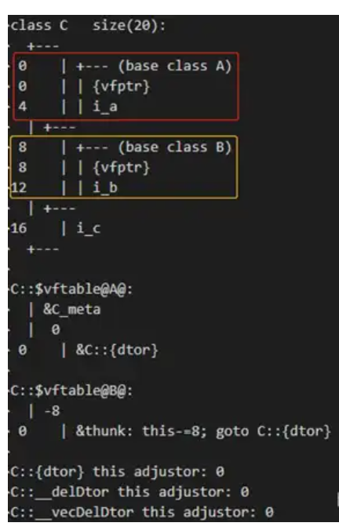

## 手撕

k个一组翻转链表

硬币dp问题

## 腾讯pcg实习一面

k个一组反转链表的变种

### tcp连接断开之后还会保持吗

TCP 使用四次挥手（Four-way Handshake）来正常关闭连接：

1. **客户端发送 FIN 包**：客户端调用 `close()`，发送 FIN 包，进入 **FIN_WAIT_1** 状态
2. **服务器回应 ACK**：服务器接收 FIN，发送 ACK，进入 **CLOSE_WAIT** 状态
3. **服务器发送 FIN 包**：服务器完成数据发送后，发送 FIN 包，进入 **LAST_ACK** 状态
4. **客户端回应 ACK**：客户端接收 FIN，发送 ACK，进入 **TIME_WAIT** 状态

##### TIME_WAIT 状态

当 TCP 连接正常关闭后，主动关闭方会进入 **TIME_WAIT** 状态，并在这个状态保持 **2MSL**（Maximum Segment Lifetime，最大报文生存时间）的时间。

- **2MSL 通常为 2-4 分钟**（不同操作系统可能不同）
- Linux 默认是 60 秒

##### 为什么需要 TIME_WAIT 状态？

1. **确保最后的 ACK 能到达对方**：如果最后一个 ACK 丢失，对方会重发 FIN，此时可以重发 ACK
2. **防止旧连接的延迟数据干扰新连接**：等待足够长的时间，确保所有在网络中的旧连接数据包都消失

### reserve预分配内存10之后，可以直接在8处insert吗？

insert的位置不可以超过size-1，不然会segmentation fault

### push_back和insert的区别

xxxxxxxxxx template <typename Derived>class Base {public:    void interface() {        // 调用派生类的实现        static_cast<Derived*>(this)->implementation();    }        void implementation() {        std::cout << "Base implementation\n";    }};​class Derived : public Base<Derived> {public:    void implementation() {        std::cout << "Derived implementation\n";    }};cpp

- **push_back()**: 总是在容器末尾添加元素
- **insert()**: 在指定位置插入元素，需要提供迭代器指定插入位置

效率上

- **push_back()**: 通常效率更高，特别是对于 `vector` 来说，尾部插入是 O(1) 操作（除非需要扩容）
- **insert()**: 可能需要移动插入点后的所有元素，对于 `vector` 和 `deque` 等容器，在中间位置插入是 O(n) 操作。后移操作时O(n)的

返回值

- **push_back()**: 无返回值（void）
- **insert()**: 返回指向新插入元素的迭代器

## 腾讯广告工程部一面

手撕ok

八股：

#### 构造函数 手写一下


#### 对于多态行为的父类和子类 父类指针指向子类时 如何用该指针调用父类

```c++
#include <iostream>

class Base {
public:
    virtual void show() {
        std::cout << "Base::show()" << std::endl;
    }
};

class Derived : public Base {
public:
    void show() override {
        std::cout << "Derived::show()" << std::endl;
    }

    void callBaseShow() {
        Base::show();  // 显式调用基类版本
    }
};

int main() {
    Derived d;
    Base* ptr = &d;

    // 方法 1：在派生类内部显式调用基类版本
    d.callBaseShow();  // 输出 "Base::show()"
    

    // 方法 2：通过基类指针调用（仍然受多态影响）
     (*ptr).show();          // 调用 Derived::show()（多态）
    static_cast<Base*>(ptr)->show();  // 仍然调用 Derived::show()（因为 show() 是虚函数）上行转换也不行
    
	//这里 Base:: 明确指定了作用域，绕过虚函数机制，在编译期直接绑定到该类的函数实现
	ptr->Base::show();  // 直接调用 Base::show()
    return 0;
}
```

## 京东零售 后台

瞎jb聊

## 腾讯云智

#### 介绍一下你的一个项目


#### unique_ptr的实现原理

禁止拷贝构造和拷贝赋值，支持移动语义

#### shared_ptr的应用场景

- **`std::unique_ptr`**：
  - **适用场景**：独占资源所有权、性能要求高、工厂模式返回对象、容器中存储动态对象。
  - **特点**：独占所有权，不可拷贝，支持移动语义，轻量级。
- **`std::shared_ptr`**：
  - **适用场景**：共享资源所有权、缓存机制、跨模块资源共享。
  - **特点**：共享所有权，通过引用计数管理生命周期，注意循环引用问题，需结合 `std::weak_ptr` 使用。

#### 虚指针只有一个吗 虚表的结构

```c++
class A {
public:
    virtual void foo() {}
    virtual void bar() {}
};

class B {
public:
    virtual void baz() {}
    virtual void qux() {}
};

class C : public A, public B {
public:
    void foo() override {}    // 覆盖 A::foo
    void baz() override {}    // 覆盖 B::baz
    virtual void quux() {}    // C 新增虚函数
};
```

###### 虚表：

A的：

`[ &A::foo, &A::bar ]`

B的：

`[ &B::baz, &B:: ]`

C的：

**多继承时**，`C` 的对象会有 **两个虚指针**：

- `vptr_A`：指向 `C` 的 `A` 部分虚表（覆盖 `A::foo`）。
- `vptr_B`：指向 `C` 的 `B` 部分虚表（覆盖 `B::baz`，并新增 `quux`）。

```
[ &C::foo, &A::bar ]  // 覆盖 A::foo
[ &C::baz, &B::qux, &C::quux ]  // 覆盖 B::baz，并追加 quux
```

##### 另一个示例：

class C同时继承自A和B：

```
class A
{
public:
	int i_a;
	void funcA1() {}
	virtual ~A() {}
};
 
class B
{
public:
	int i_b;
	void funcB1() {}
	virtual ~B() {};
};
 
class C :public A, public B
{
public:
	int i_c;
	virtual ~C() {}
};


```

C的内存布局：

派生类C中依其继承的基类的顺序，存放了各个**[基类subobject]及各自的vptr**，然后才是Class C自己的数据成员



**Thunk解释**：所谓thunk是一小段assembly代码，用来(1)以适当的offset值调整this指针，(2)跳到virtual function去。

经由class A的指针调用C的析构函数，其offset等于0；而经由class B调用C的析构函数，其offset等于8，如同上图所示：this-=8。

```c++
class A { /* ... */ };
class B { /* ... */ };
class C : public A, public B { /* ... */ };
```

在这种情况下，`C` 的对象在内存中的布局通常是：

```c++
+-------------------+
| A 的成员变量      |  // A 子对象
+-------------------+
| B 的成员变量      |  // B 子对象
+-------------------+
| C 的成员变量      |  // C 自身的成员变量
+-------------------+
```

- `A` 子对象位于 `C` 对象的最前面。
- `B` 子对象紧随 `A` 子对象之后。
- `C` 自身的成员变量位于 `A` 和 `B` 子对象之后。

因此，当用 `B*` 指针指向 `C` 的对象时，`B*` 指针实际上指向的是 `C` 对象中 `B` 子对象的起始地址，而不是 `C` 对象的起始地址。

## 字节财经一面

#### 多个进程可以都处于内核态吗

每个 CPU 核心都有自己独立的寄存器组，包括通用寄存器（如 `rax`, `rbx`）、控制寄存器（如 `cr3` 页表寄存器，sp，pc等）、浮点寄存器等。

现代 CPU 通常是多核架构，每个核心（Core）可以独立运行线程或进程。

#### **多个进程如何同时执行同一个系统调用？**

1. **每个进程有独立的执行上下文**

- **寄存器状态**：每个进程在进入内核态时，CPU 的寄存器（如 `SP`、`PC`、`RAX` 等）会被保存并恢复，确保不同进程的内核态执行互不干扰。
- **栈空间**：每个进程有独立的内核栈（`kernel stack`），用于存储系统调用的局部变量和返回地址。

2. **内核代码是只读的，但数据是进程相关的**

​	**系统调用代码**（如 `sys_read()`）是共享的，但 **操作的数据** 是进程独立的：

- **文件描述符表**：每个进程有自己的文件描述符表，`fd=3` 在进程 A 和 B 中可能指向不同的文件。
- **用户空间缓冲区**：`read()` 的 `buf` 参数指向的是进程自己的虚拟地址空间，内核通过 `copy_to_user()` 将数据拷贝到正确的位置。


## 腾讯云智二面

介绍项目

## 腾讯地图一面

#### 对cpp面向对象的理解 结合应用 其他语言不行吗

两种class  含有指针和不含有指针

类的关系本质有三种，继承，复合，委托


#### 上次面试哪里没答好

#### 实际项目或者实习中有用到多态吗  

#### 线程进程协程

并发编程中的三种基本执行单元，

* 进程：由于**每个进程都有独⽴的内存空间**，进程间互不干扰。

  **进程间上下文切换开销大，上下文信息多**，创建和销毁进程的开销较⼤，需要操作系统介入，涉及内存复制、上下文切换等操作。 

  由操作系统调度。

* 线程：是进程内的执⾏单元，  线程的上下文内容较少（寄存器 线程栈   使用TCB记录信息：tid ）

  一个进程中可以同时存在多个线程，各个线程之间可以并发执行；

  各个线程之间可以共享地址空间和文件等资源；

  创建、切换线程比进程快，但仍需操作系统调度（抢占式）。

* 协程：用户态的轻量级线程，由**程序员控制调度**（非操作系统调度）。

  协程共享线程空间，仅保存少量寄存器状态（如栈指针、程序计数器），可在单线程内实现并发。

  协程主动让出 CPU（yield)，由程序员决定何时切换。

#### 如何在cpp中实现协程

##### **协程的并发本质：协作式调度**

- **协作式调度**：协程的切换由程序员显式控制（如通过 `yield` 或 `await`），而非操作系统强制抢占。当一个协程主动让出控制权时，调度器选择下一个就绪的协程执行。
- **单线程内的并发**：多个协程共享同一线程的 CPU 时间片，通过快速切换实现“伪并行”（非真正的并行）。
- **轻量级切换**：协程切换仅需保存/恢复少量寄存器状态（如程序计数器、栈指针），无需操作系统介入。

##### **事件循环（Event Loop）**

- **核心机制**：事件循环是协程调度的核心，负责管理协程的挂起、恢复和 I/O 事件监听。
- 工作流程
  1. 注册协程任务到事件循环。
  2. 事件循环轮询 I/O 事件（如网络请求、定时器）。
  3. 当协程遇到 I/O 阻塞时，将其挂起并注册回调。
  4. I/O 完成后，事件循环恢复协程执行。

##### **非阻塞 I/O 与异步系统调用**

- **非阻塞 I/O**：协程通过异步 API（如 `async/await`）执行 I/O 操作，避免线程阻塞。
- **底层实现**：操作系统提供异步 I/O 接口（如 Linux 的 `epoll`、Windows 的 `IOCP`），协程调度器利用这些接口实现高效的多路复用。

#####  **协程池与任务调度**

- **协程池**：预分配协程对象，减少动态创建开销。
- **任务队列**：将待执行的协程放入队列，由调度器按需分配到线程。

#### QPS和线程的关系 10 100 10k 100k

主要展示思路

最佳线程数 = ((线程等待时间 + 线程CPU时间) / 线程CPU时间) × CPU核心数

**关键参数**：

- **线程等待时间（W）**：任务因 I/O 阻塞、锁竞争等非计算操作消耗的时间。
- **线程CPU时间（C）**：任务实际占用 CPU 进行计算的时间。

目的是让CPU满载，CPU 实际工作时间占比为 `C / (W + C)`。

比如线程总耗时=50ms（CPU 20ms + I/O 30ms），CPU核心数=8，那么单线程下cpu实际工作时间为40%，因此单核需要2.5个线程即满载，8核需要20个线程。即 `(50/20) × 8 = 20`。

##### **不同QPS场景下的线程需求**

需要考虑任务类型，**CPU密集型任务**，**IO密集型任务**

* **CPU密集型任务**

  - **特点**：CPU计算时间长（如加密、图像处理），I/O等待时间短。

  - **最佳线程数**：接近CPU核心数（如8核→8线程）。

* **O密集型任务**

  - **特点**：I/O等待时间长（如数据库查询、网络请求），CPU计算时间短。

  - **线程数**：可远高于CPU核心数（如100~1000线程）。

  - **公式**：`线程数 = CPU核心数 × (1 + I/O等待时间 / CPU时间)`

假设任务类型为**混合负载**（含CPU和I/O），且**RT=100ms**（CPU时间20ms，I/O等待80ms），每个任务对cpu的占用率为20%，因此单核需要5个线程才会满载。

| **目标QPS**  | **单线程QPS** | **理论线程数** | **实际线程数（考虑资源限制）** |                         **关键原因**                         |
| :----------: | :-----------: | :------------: | :----------------------------: | :----------------------------------------------------------: |
|  **10 QPS**  |      10       |       1        |              1~2               |              单线程即可满足需求，无需额外线程。              |
| **100 QPS**  |      100      |       10       |             10~16              | 线程数需达到10以支持QPS=100，但需考虑CPU核心数（如8核时可能需调整）。 |
| **10k QPS**  |    10,000     |     1,000      |            200~500             | 高并发场景下，需结合线程池配置（如队列、拒绝策略）和异步I/O优化。 |
| **100k QPS** |    100,000    |     10,000     |          2,000~10,000          | 需分布式架构（多机负载均衡）或极致优化（如无锁设计、批处理）。 |


#### 限制线程处理能力的瓶颈在哪里

- **最佳线程数前**：QPS与线程数近似线性增长。
- 最佳线程数后：

  - **QPS持平**：资源（如CPU、内存）成为瓶颈，增加线程数无意义。
  - **QPS下降**：上下文切换开销剧增，锁竞争加剧（如Java的`ConcurrentHashMap`锁分段失效）。


###### CPU瓶颈

* 表现：
  * **CPU利用率长期接近100%**，但QPS无法提升。

* 原因：
  * **计算密集型任务**：任务本身需要大量CPU计算（如加密、图像处理）。
  * **锁竞争**：多线程竞争共享资源（如全局计数器、ConcurrentHashMap）导致阻塞。

* 分析方法

  - **监控工具**：通过 `top`、`htop` 或 Prometheus 监控CPU利用率。

  - **火焰图（Flame Graph）**：使用 `perf` 或 `Async Profiler` 生成火焰图，定位高CPU消耗的代码段。

###### **内存瓶颈**

* 表现

  - **频繁触发GC（垃圾回收）**，尤其是Full GC导致应用暂停。

  - **堆内存使用率长期接近上限**，甚至出现 `OutOfMemoryError`。

* 原因

  - **对象创建过多**：未复用对象（如频繁创建临时对象）。

  - **内存泄漏**：未释放不再使用的对象（如未关闭数据库连接）。

  - **大对象分配**：单次请求分配超大对象（如缓存大量数据）。

* 分析方法
  * **堆转储（Heap Dump）**：使用 `jmap` 或 `VisualVM` 导出堆转储文件，分析内存占用。
  * **GC日志分析**：通过 `-Xloggc` 参数记录GC日志，检查GC频率和停顿时间

###### **I/O 瓶颈**

* 表现

  - **磁盘/网络I/O利用率接近100%**，但CPU和内存利用率较低。

  - **请求因I/O等待而堆积**，队列长度持续增长。

* 原因

  - **数据库查询慢**：未命中索引、全表扫描等。

  - **磁盘性能不足**：机械硬盘随机读写延迟高。
  - **网络带宽不足**：高并发请求导致带宽饱和。

* 分析工具

  * **iostat / nmon**：监控磁盘I/O吞吐量和响应时间。
  * **网络监控**：通过 `iftop`、`nload` 或云平台监控网络带宽。
  * **数据库慢查询日志**：启用数据库慢查询分析（如MySQL的 `slow_query_log`）。

#### cpp如何调试 coredump一定能定位到问题代码吗 什么情况不能

##### 可定位的场景

* 内存访问越界或非法指针： 空指针解引用、数组越界、野指针、悬空指针等。
* **未捕获的异常**： C++异常未通过 `try-catch` 捕获，导致程序调用 `std::terminate`。
* **多线程竞争条件**: 多线程程序因竞态条件（Race Condition）导致数据破坏。
  - 使用 `thread apply all bt` 查看所有线程的堆栈。
  - 结合内存检查工具（如Valgrind）分析数据竞争

##### 不可定位的情况

* 缺少调试符号信息： 编译时未添加 `-g` 选项，导致Core Dump中仅包含内存地址而非源码行号

* **内存破坏导致堆栈损坏**： 缓冲区溢出、堆内存越界写入等破坏了堆栈结构。`bt` 命令显示混乱的调用栈（如重复的无效地址）

  ```
  void func() {
      char buffer[10];
      strcpy(buffer, "This is a very long string");  // 缓冲区溢出
  }
  ```

##### 如何生成和调试coredump

* 启用Core Dump生成

  ```
  ulimit -c unlimited  # 允许生成任意大小的core文件（临时生效）
  ```

* 编译程序,保留调试信息

  ```
  gcc -g -O0 -o demo demo.c  # -g生成调试符号，-O0禁用优化
  ```

* **使用GDB调试Core Dump**

  ```
  gdb ./demo core-demo-12345  # 程序名和core文件名需匹配
  (gdb) bt
  (gdb) frame 0  # 切换到第0帧（崩溃位置）
  (gdb) info locals  # 查看局部变量
  
  (gdb) info threads  # 查看所有线程
  ```

  

#### 你最擅长的领域

#### 贪心和动态规划的区别 什么问题贪心无法解决

## 字节财经二面

介绍实习的一个开发项目，用户是谁，为什么要开发，跟mviz的区别，手动去播放看算法结果吗，最后谁在用，html生成时间有优化吗，其中最有挑战性的地方

手撕单词接龙

场景题 设计一个支付宝（支持解绑绑定银行卡，支持充值提现）从面向对象的角度 设计哪些class

