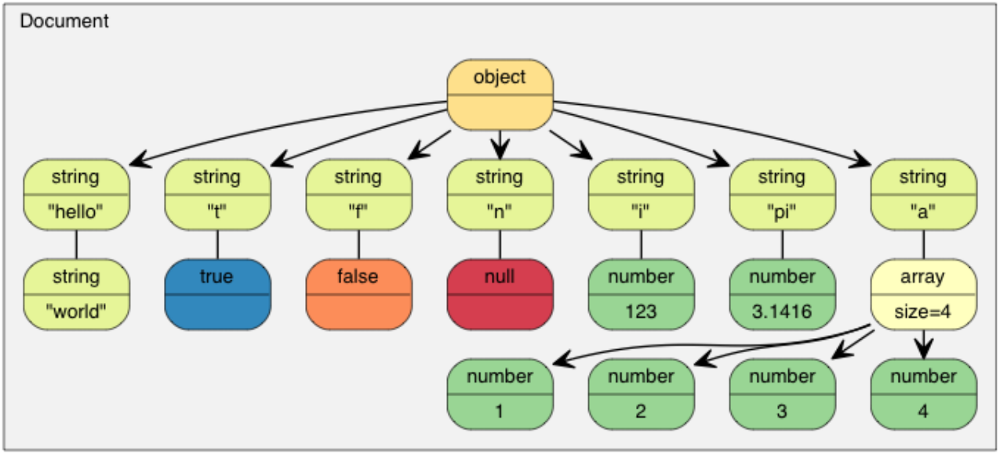
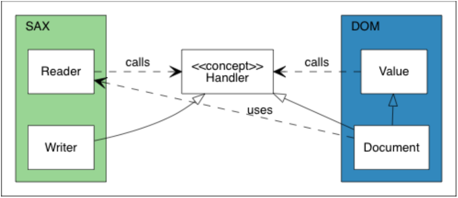
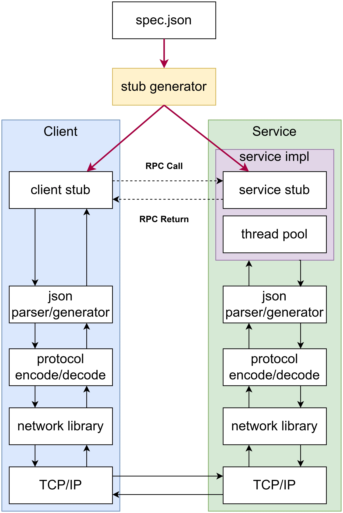

## JSON parser generator

如何实现从文件和从内存的读写

如何解析json  

如何在内存中保存json(DOM)  value类

SAX和DOM的区别

### 项目简介

goa-json是一款基于C++17开发的header-only JSON解析/生成器，采用递归下降的方式进行解析，支持`DOM(Document Object Model)`和`SAX(Simple API for XML)`两种API风格:

- `DOM`是一种基于树状结构的JSON解析模型。在DOM解析中，整个JSON文件被加载到内存中并表示为一个树状结构的对象模型，JSON中的每个元素都对应一个节点，这些节点可以通过编程接口进行访问、遍历和修改。DOM解析允许应用程序以树状结构的方式直接操作JSON数据，但可能需要更多的内存和计算资源，尤其是对于大型文档。DOM的优点是易于编写代码和操作，特别适用于需要频繁随机访问JSON数据的情况。
- `SAX`是一种基于事件的JSON解析模型。在SAX解析中，JSON文档被顺序解析，当解析器遇到特定的JSON元素或事件（如开始标签、结束标签、文本内容等）时，它会触发相应的事件，从而允许应用程序在处理过程中做出响应。SAX解析器一次只解析文档的一部分，因此适用于处理大型JSON文档，因为它不需要将整个文档加载到内存中。SAX的优点是效率高，占用的内存少，但在代码编写上通常需要更多的处理逻辑。

以如下JSON字符串为例：

```
{
    "hello": "world",
    "t": true ,
    "f": false,
    "n": null,
    "i": 123,
    "pi": 3.1416,
    "a": [1, 2, 3, 4]
}
```

其DOM树构建为：



### 项目架构

goa-json定义有三个核心concept，分别是`ReadStream`、`WriteStream`和`Handler`:

- `ReadStream`用于读取字符流，目前实现了`StringReadStream`和`FileReadStream`分别用于从内存和文件中读取字符。
- `WriteStream`用于输出字符流，目前实现了`StringWriteStream`和`FileWriteStream`分别用于向内存和文件中输出字符。
- `Handler`是解析和生成时，用于事件触发和执行的对象，目前实现了SAX风格的`Writer`用于向`WriteStream`输出字符，以及DOM风格的`Document`用于构建JSON对象的树形存储结构。

其中，`ReadStream`和`WriteStream`的实现只能为`StringXXX`和`FileXXX`，通过`enable_if_t`进行编译期模板参数类型检查；`Handler`除现有实现外，支持自定义，以进行定制化操作。



关系的核心是`Handler`概念。在SAX一边，`Reader`从流解析JSON并将事件发送到`Handler`。`Writer`实现了`Handler`概念，用于处理相同的事件，并将解析结果传入输出流。在DOM一边，`Document`实现了`Handler`概念，用于通过这些事件来构建DOM。在这个设计，SAX是不依赖于DOM的。甚至`Reader`和`Writer`之间也没有依赖。这提供了连接事件发送器和处理器的灵活性。除此之外，`Value`也是不依赖于SAX的。所以，除了将DOM序列化为JSON之外，用户也可以将其序列化为XML，或者做任何其他事情。

下面是类关系的详细uml图。

xxxxxxxxxx template <typename Derived>class Base {public:    void interface() {        // 调用派生类的实现        static_cast<Derived*>(this)->implementation();    }        void implementation() {        std::cout << "Base implementation\n";    }};​class Derived : public Base<Derived> {public:    void implementation() {        std::cout << "Derived implementation\n";    }};cpp

### 值（Value）

goa-json中自定义了可变类型数据存储类`Value`，其设计类似于QT中的QVariant和C++17中的Variant，json文档中的每一个元素（DOM树状结构上的叶子节点或子树）都可以用`Value`来存储，是DOM API的核心。其内部维护一个union来存储数据并节约存储空间，xxx：

```c++
using StringWithRefCount =
  AddRefCount<std::vector<char>>;  // json string类型 保存字符串
using ArrayWithRefCount =
  AddRefCount<std::vector<Value>>;  // json array类型 保存json值
using ObjectWithRefCount =
  AddRefCount<std::vector<Member>>;  // json object类型 保存键值对
union {
    bool                b_;
    int32_t             i32_;
    int64_t             i64_;
    double              d_;
    StringWithRefCount* s_;
    ArrayWithRefCount*  a_;
    ObjectWithRefCount* o_;
};
```

并使用`enum class`定义了`ValueType`来表示当前`Value`的类型，防止命名空间污染：

```
enum class ValueType {
    TYPE_NULL,
    TYPE_BOOL,
    TYPE_INT32,
    TYPE_INT64,
    TYPE_DOUBLE,
    TYPE_STRING,
    TYPE_ARRAY,
    TYPE_OBJECT
};
```

`Value`内部定义了`isXXX()`、`getXXX()`和`setXXX([args])`，分别用来判断类型、访问成员和修改成员（XXX可为Null、Bool、Int32、Int64、Double、String、Array和Object）。其中getXXX()中对类型断言判断以进行类型检查，若Value本身类型与getXXX()类型不一致，在Debug模式下将因断言失败而崩溃。


## EV

### 项目简介

goa-ev是一款基于C++20开发的适用于Linux的事件驱动型多线程网络库，附带有日志、定时器、线程池模块，只依赖STL，无第三方依赖。日志模块使用了C++20标准库中的**format**来进行格式化输出，也是整个项目唯一依赖C++20的模块，其余部分均依赖于C++11实现。参考陈硕的muduo网络库，基于one loop per thread搭配线程池的方式实现multi-reactor架构。

### 项目架构


goa-ev的核心架构如上图所示，其核心模块为Channel，EPollPoller和EventLoop。服务端为一个**TcpServer**实例，该实例中可包含有多个**TcpServerSingle**实例，每个**TcpServerSingle**实例都对应有一个**EventLoop**，运行在一个独立线程中，其通过调用loop监听和处理事件。每个**TcpServerSingle**都包含有独立的**Acceptor**负责监听同一个服务器端口，并在连接到来时通过调用**newConnectionCallback**来对连接事件进行处理。该回调函数由**TcpServerSingle**传入**Acceptor**，负责建立连接对象**TcpConnection**。当客户端连接请求到来时，若有多个**Acceptor**监听同一个服务器端口（已开启**SO_REUSEPORT**选项），则由操作系统采用相对公平的方式决定将连接分配给哪个线程，从而实现负载均衡。

### 具体实现

#### 日志的实现

设置日志等级  

使用std::format  

使用std::osyncstream 保证线程安全，保证单个输出操作是原子的（不会被其他线程的输出打断），确保来自不同线程的输出不会相互交错

#### 定时器的实现 

```
  using Entry = std::pair<Timestamp, Timer*>;
  using TimerList = std::set<Entry>;
```

使用set保存Timer，set由红黑树实现，头部的Timer的timestamp最小

用epoll监听timerfd（ Linux 提供的一种定时器接口），定时器到期之后，会有可读事件

每个eventloop中含有TimerQueue，TimerQueue有自己的timerfd_和timerlist

#### 连接器

三个主要模块Channel，EPollPoller和EventLoop。

##### Channel

每个fd对应一个channel， fd有三类：服务端监听fd、连接建立后的连接fd和定时器fd，分别对应 Acceptor、Tcpconnection和timequeue。其都包含自己的channel，并可设置channel的各种callback，并将channel交给epoll监听。当发生事件时，调用channel的callback。

Acceptor对服务器监听套接字fd及其相关方法进行封装（监听、接受连接、分发连接给SubEventLoop等），TcpConnection对连接套接字fd及其相关方法进行封装（读消息事件、发送消息事件、连接关闭事件、错误事件等）。

每个TcpServerSingle都含有相同的Acceptor，交给epoll监听，并通过newConnectionCallback_处理新的连接，newConnectionCallback会建立Tcpconnection实例，并设置Tcpconnection的回调。Tcpconnection在初始化时会设置自己对应的channel的回调，实际是将上层传递给Tcpconnection的回调继续传递给channel。

##### EPollPoller

EpollPoller负责管理channel   监听感兴趣事件

##### EventLoop

每个TcpServerSingle有自己对应的eventloop实例，即one loop per thread。其含有pendingTasks_和timerQueue两个重要成员，通过loop监听fd和处理事件，执行fd对应的channel所管理的callback函数，同时处理上层添加的task。


##### 过程

服务端为一个**TcpServer**实例，该实例中可包含有多个**TcpServerSingle**实例，每个**TcpServerSingle**实例都对应有一个**EventLoop**，运行在一个独立线程中，其通过调用loop监听和处理事件。

每个**TcpServerSingle**都包含有独立的**Acceptor**负责监听同一个服务器端口，并在连接到来时通过调用**newConnectionCallback**来对连接事件进行处理。**TcpServerSingle**为每个新连接建立TcpConnection实例，放入自己管理的**ConnectionSet**中，同时设置tcp连接fd的回调函数。


#### 线程池的实现  

生产者消费者模型

维护一个taskqueue  所有进程循环执行take，从队列中取出任务。 在外围通过其他模块添加task

使用std::promise和std::future获取结果

- **std::promise**: 承诺在未来某个时间点提供一个值
- **std::future**: 用于获取 promise 设置的未来值

下面的addoneServer的示例   线程池负责执行addone任务

```c++
    std::promise<long long> res_promise;  // 线程间通信 获取结果
    std::future<long long> res_future = res_promise.get_future();

    // 利用线程池执行计算任务
    threadPool_.runTask([&]() {
      long long oldNum = std::stoll(buffer.retrieveAllAsString());
      int ttid = static_cast<pid_t>(syscall(SYS_gettid));
      buffer.append("calculation handled by tid " + std::to_string(ttid) +
                    ": ");
      res_promise.set_value(oldNum + 1);
    });

    std::string res = std::to_string(
        res_future.get());  //调用res_future.get()会阻塞，等待线程池的计算结果
```

### reactor相关


## RPC

### 项目简介

goa-rpc是一款基于C++20开发的使用于Linux的RPC（Remote Procedure Call）框架，使用JSON数据格式作为序列化/反序列化方案，实现了JSON-RPC 2.0协议。客户端支持异步RPC调用，也可以通过线程同步达到同步RPC调用的效果。服务端支持基于线程池的多线程RPC，以提高IO线程的响应速度和处理能力上限。服务采用service.method的命名方式，一个TCP端口可以对外提供多个service，每个service中可以含有多个method。

### 项目架构



本项目编译生成的文件中包含有一个stub generator，可以根据spec.json中对一组rpc request和response的完整描述，自动生成client端和server端的stub代码。使用时client端（RPC调用方）只需包含生成的ClientStub头文件即可获取到相应的RPC服务，server端（RPC被调用方）除了要包含生成的ServiceStub头文件外，还需实现所提供的RPC服务的具体函数逻辑。

goa-RPC中的JSON序列化与反序列化模块基于[GOA-JSON](https://github.com/tianhang-Z/goa-json)实现，网络模块基于[GOA-EV](https://github.com/tianhang-Z/goa-ev)实现。goa-JSON的测试依赖于googletest和benchmark，除此之外无其他依赖。

##### 序列化和反序列化

序列化（Serialization）
是将数据结构或对象转换成一种可存储或可传输格式的过程。在序列化后，数据可以被写入文件、发送到网络或存储在数据库中，以便在需要时可以再次还原成原始的数据结构或对象。序列化的过程通常涉及将数据转换成字节流或类似的格式，使其能够在不同平台和编程语言之间进行传输和交换。

反序列化（Deserialization）
是序列化的逆过程，即将序列化后的数据重新还原成原始的数据结构或对象。反序列化是从文件、网络数据或数据库中读取序列化的数据，并将其转换回原始形式，以便在程序中进行使用和操作。

##### rpc2.0协议


## Momenta实习

* 负责团队分支管理、版本提测和主线提测，将产物部署到测试车辆工控机进行LPNP、RADS、NRP功能测试和录包。
* 为降低cpu负载，开发了模块耗时统计工具和timecost topic，通过编译选项和条件编译设置工具开关，利用宏展开执行待测模块，利用RAII特性设计耗时统计类，利用静态管理器管理嵌套的类实例，将模块的耗时信息存入json中，并发出topic和上线CT，利用火焰图显示；
* 基于mfr消息通信机制，开发了新的debug topic，支持用户添加已定义的debug信息类型，如render、chart和table信息，并序列化各模块的debug信息以topic发出。之后基于bokeh库和docker开发并部署了user plot插件，上下MVIZ平台，支持对topic的解析和渲染并生成可视化的静态html文件，新topic比旧有方式数据量显著降低，上线后可数据回流，便于部门分析corner case。  


### RAII

RAII(Resource Acquisition Is Initialization)是C++中一种重要的编程范式，它将资源的生命周期与对象的生命周期绑定在一起，通过对象的构造和析构来自动管理资源。

RAII的基本原则是：

- **资源获取即初始化**：在对象构造时获取资源
- **资源释放即析构**：在对象析构时释放资源

### 静态管理器

**静态管理器（Static Manager）** 是一种 **单例模式（Singleton Pattern）** 的实现方式，用于在整个程序运行期间 **全局唯一地管理某个资源或状态**。它通常以 **静态成员函数** 或 **静态局部变量** 的形式存在，确保 **只有一个实例** 被创建，并且可以在程序的任何地方访问。

**静态管理器的核心特点**

1. **全局唯一性**
   - 整个程序运行期间，静态管理器 **只有一个实例**。
   - 通常通过 **静态方法**（如 `getInstance()`）访问。
2. **自动生命周期管理**
   - 静态管理器在 **第一次调用 `getInstance()` 时初始化**，并在 **程序结束时自动销毁**（C++ 的静态存储期特性）。
3. **线程安全（可选）**
   - 在多线程环境下，静态管理器可能需要额外的同步机制（如 `std::mutex` 或 C++11 的 `magic static` 特性）。
4. **隐藏构造函数**
   - 通常将构造函数设为 `private` 或 `protected`，防止外部直接创建实例。

### timecost代码


```cpp
#include <iostream>
#include <chrono>
#include <string>
#include <memory>
#include <nlohmann/json.hpp>
#include <deque>

using json = nlohmann::json;

class TimeCostManager {
public:
    static TimeCostManager& getInstance() {
        static TimeCostManager instance;
        return instance;
    }

    // 注册当前任务（压栈）
    void push(const std::string& name, std::shared_ptr<json> task_json) {
        task_stack_.push_back({name, task_json});
    }

    // 获取当前任务的父任务 JSON（栈顶的下一个）
    std::shared_ptr<json> getParentJson() {
        if (task_stack_.size() < 2) {
            return nullptr; // 没有父任务
        }
        return task_stack_[task_stack_.size() - 2].second; // 栈顶的下一个就是父任务
    }

    // 移除当前任务（弹栈）
    void pop(const std::string& name, const json& task_result) {
        if (task_stack_.empty()) return;

        auto [current_name, current_json] = task_stack_.back();
        task_stack_.pop_back();

        // 更新当前任务的耗时
        current_json->at("duration_us") = task_result.at("duration_us");
        current_json->at("duration_ms") = task_result.at("duration_ms");

        // 如果栈不为空，则栈顶就是父任务
        if (!task_stack_.empty()) {
            auto& parent_json = task_stack_.back().second;
            if (!parent_json.contains("children")) {
                parent_json["children"] = json::array();
            }
            parent_json["children"].push_back(*current_json);
        } else {
            // 如果没有父任务，直接输出
            std::cout << *current_json << std::endl;
        }
    }

private:
    TimeCostManager() = default;
    ~TimeCostManager() = default;

    std::deque<std::pair<std::string, std::shared_ptr<json>>> task_stack_;
};

class TimeCost {
public:
    explicit TimeCost(const std::string& name = "") 
        : start_time(std::chrono::high_resolution_clock::now()), 
          name_(name) {
        
        auto current_json = std::make_shared<json>();
        current_json->["name"] = name_;
        current_json->["start_time"] = getCurrentTime();

        // 注册到管理器
        TimeCostManager::getInstance().push(name_, current_json);
        current_json_ = current_json;
    }

    ~TimeCost() {
        auto end_time = std::chrono::high_resolution_clock::now();
        auto duration = std::chrono::duration_cast<std::chrono::microseconds>(end_time - start_time);

        // 记录耗时
        json result;
        result["duration_us"] = duration.count();
        result["duration_ms"] = duration.count() / 1000.0;

        // 从管理器移除并更新父任务
        TimeCostManager::getInstance().pop(name_, result);
    }

private:
    std::chrono::time_point<std::chrono::high_resolution_clock> start_time;
    std::string name_;
    std::shared_ptr<json> current_json_;

    std::string getCurrentTime() {
        auto now = std::chrono::system_clock::now();
        auto in_time_t = std::chrono::system_clock::to_time_t(now);
        return std::ctime(&in_time_t); // 返回 C 风格字符串（带换行符）
    }
};
```

```c++
// 使用示例
void nestedExample() {
    TimeCost outer("outer_task");  // 独立任务

    {
        TimeCost inner("inner_task");  // 自动嵌套到 outer_task
        for (volatile int i = 0; i < 100000; ++i);
    }  // inner_task 结束，自动写入 outer_task 的 children

    for (volatile int i = 0; i < 500000; ++i);
}  // outer_task 结束，自动输出 JSON

int main() {
    {
        TimeCost tc("task1");
        for (volatile int i = 0; i < 1000000; ++i);
    }  // 输出 task1 的 JSON

    std::cout << "\n--- Nested Example ---\n";

    nestedExample();

    return 0;
}
```


